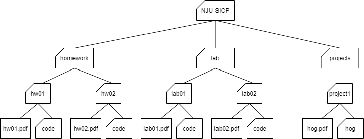

# Homework 04: Data Abstraction, Lists, and Trees

## 1. Instructions

> Please download homework materials `hw04.zip` from our QQ group if you don't have one.

In this homework, you are required to complete the problems described in section 3. The starter code for these problems is provided in `hw04.py` and `shakespeare.py`, which is distributed as part of the homework materials in the `code` directory.

**Submission**: When you are done, submit your code to our [OJ website](http://114.212.84.18) as instructed in lab00. You may submit more than once before the deadline; only the final submission will be scored. See lab00 for more instructions on submitting assignments.

**Readings**: You might find the following references to the textbook useful:
- [Section 2.2](https://composingprograms.com/pages/22-data-abstraction.html)
- [Section 2.3](https://composingprograms.com/pages/23-sequences.html)

## 2. Review

Consult this section if you need a refresher on the material for this lab. It's okay to skip directly to the next section and refer back here should you get stuck.

### 2.1 Lists

Lists are Python data structures that can store multiple values. Each value can be any type and can even be another list! A list is written as a comma separated list of expressions within square brackets:

```
>>> list_of_nums = [1, 2, 3, 4]
>>> list_of_bools = [True, True, False, False]
>>> nested_lists = [1, [2, 3], [4, [5]]]
```

Each element in a list is assigned an index. Lists are zero-indexed, meaning their indices start at 0 and increase in sequential order. To retrieve an element from a list, use list indexing:

```
>>> lst = [6, 5, 4, 3, 2, 1]
>>> lst[0]
6
>>> lst[3]
3
```

Often times we need to know how long a list is when we're working with it. To find the length of a list, call the function `len` on it:

```
>>> len([])
0
>>> len([2, 4, 6, 8, 10])
5
```

> Tip: Recall that empty lists, [], are falsy values. Therefore, you can use an if statement like the following if you only want to do operations on non-empty lists:
>
> ```python
> if lst:
>     # Do stuff with the elements of list
> ```
> This is equivalent to:
> ```python
> if len(lst) > 0:
>     # Do stuff
> ```

You can also create a copy of some portion of the list using list slicing. To slice a list, use this syntax: `lst[<start index>:<end index>]`. This expression evaluates to a new list containing the elements of `lst` starting at and including the element at `<start index>` up to but not including the element at `<end index>`.

```python
>>> lst = [True, False, True, True, False]
>>> lst[1:4]
[False, True, True]
>>> lst[:3]  # Start index defaults to 0
[True, False, True]
>>> lst[3:]  # End index defaults to len(lst)
[True, False]
>>> lst[:]  # Creates a copy of the whole list
[True, False, True, True, False]
```

### 2.2 List Comprehensions
List comprehensions are a compact and powerful way of creating new lists out of sequences. The general syntax for a list comprehension is the following:

```
[<expression> for <element> in <sequence> if <conditional>]
```

The syntax is designed to read like English: *"Compute the expression for each element in the sequence if the conditional is true for that element."*

Let's see it in action:

```
>>> [i**2 for i in [1, 2, 3, 4] if i % 2 == 0]
[4, 16]
```

Here, for each element `i` in `[1, 2, 3, 4]` that satisfies `i % 2 == 0`, we evaluate the expression `i**2` and insert the resulting values into a new list. In other words, this list comprehension will create a new list that contains the square of each of the even elements of the original list.

If we were to write this using a for statement, it would look like this:

```
>>> lst = []
>>> for i in [1, 2, 3, 4]:
...     if i % 2 == 0:
...         lst = lst + [i**2]
>>> lst
[4, 16]
```

> Note: The if clause in a list comprehension is optional. For example, you can just say:
>
> ```
> >>> [i**2 for i in [1, 2, 3, 4]]
> [1, 4, 9, 16]
> ```

### 2.3 Data Abstraction

Data abstraction is a powerful concept in computer science that allows programmers to treat code as objects -- for example, car objects, chair objects, people objects, etc. That way, programmers don't have to worry about how code is implemented -- they just have to know *what* it does.

Data abstraction mimics how we think about the world. When you want to drive a car, you don't need to know how the engine was built or what kind of material the tires are made of. You just have to know how to turn the wheel and press the gas pedal.

An abstract data type consists of two types of functions:

- **Constructors**: functions that build the abstract data type.
- **Selectors**: functions that retrieve information from the data type.

Programmers design ADTs to abstract away how information is stored and calculated such that the end user does *not* need to know how constructors and selectors are implemented. The nature of *abstract* data types allows whoever uses them to assume that the functions have been written correctly and work as described.

### 2.4 Trees

A `tree` is a data structure that represents a hierarchy of information. A file system is a good example of a tree structure. For example, within your `NJU-SICP` folder, you have folders separating your `projects`, `lab` assignments, and `homework`. The next level is folders that separate different assignments, `hw01`, `lab01`, `hog`, etc., and inside those are the files themselves, including the `code` directory where the starter files are placed. Below is an incomplete diagram of what your `NJU-SICP` directory might look like.



As you can see, unlike trees in nature, the tree abstract data type is drawn with the root at the top and the leaves at the bottom.

Some tree terminology:

- **root**: the node at the top of the tree
- **label**: the value in a node, selected by the label function
- **branches**: a list of trees directly under the tree's root, selected by the branches function
- **leaf**: a tree with zero branches
- **node**: any location within the tree (e.g., root node, leaf nodes, etc.)

Our tree abstract data type consists of a root and a list of its branches. To create a tree and access its root value and branches, use the following constructor and selectors:

- Constructor
  - `tree(label, branches=[])`: creates a tree object with the given `label` value at its root node and list of `branches`. Notice that the second argument to this constructor, `branches`, is optional - if you want to make a tree with no branches, leave this argument empty.
- Selectors
  - `label(tree)`: returns the value in the root node of tree.
  - `branches(tree)`: returns the list of branches of the given tree.
- Convenience function
  - `is_leaf(tree)`: returns `True` if `tree`'s list of `branches` is empty, and `False` otherwise.

For example, the tree generated by

```python
number_tree = tree(1,
         [tree(2),
          tree(3,
               [tree(4),
                tree(5)]),
          tree(6,
               [tree(7)])])
```

would look like this:

```
   1
 / | \
2  3  6
  / \  \
 4   5  7
```

To extract the number `3` from this tree, which is the label of the root of its second branch, we would do this:

```python
label(branches(number_tree)[1])
```

The `print_tree` function prints out a tree in a human-readable form. The exact form follows the pattern illustrated above, where the root is unindented, and each of its branches is indented one level further.

```python
def print_tree(t, indent=0):
    """Print a representation of this tree in which each node is
    indented by two spaces times its depth from the root.

    >>> print_tree(tree(1))
    1
    >>> print_tree(tree(1, [tree(2)]))
    1
      2
    >>> numbers = tree(1, [tree(2), tree(3, [tree(4), tree(5)]), tree(6, [tree(7)])])
    >>> print_tree(numbers)
    1
      2
      3
        4
        5
      6
        7
    """
    print('  ' * indent + str(label(t)))
    for b in branches(t):
        print_tree(b, indent + 1)
```

## 3. Required Problems

In this section, you are required to complete the problems below and submit your code to `Contest hw04` in our [OJ website](http://114.212.84.18) as instructed in lab00 to get your answer scored.

### Problem 1: Couple (100pts)
Implement the function `couple`, which takes in two lists and returns a list that contains lists with i-th elements of two sequences coupled together. You can assume the lengths of two sequences are the same. Try using a list comprehension.

```python
def couple(lst1, lst2):
    """Return a list that contains lists with i-th elements of two sequences
    coupled together.
    >>> lst1 = [1, 2, 3]
    >>> lst2 = [4, 5, 6]
    >>> couple(lst1, lst2)
    [[1, 4], [2, 5], [3, 6]]
    >>> lst3 = ['c', 6]
    >>> lst4 = ['s', '1']
    >>> couple(lst3, lst4)
    [['c', 's'], [6, '1']]
    """
    assert len(lst1) == len(lst2)
    "*** YOUR CODE HERE ***"
```

Remember to use doctest to test your code:

    $ python -m doctest hw04.py

### Problem 2: City Data Abstraction (100 + 100 pts)

Say we have an abstract data type for cities. A city has a name, a latitude coordinate, and a longitude coordinate.

Our ADT has one **constructor**:

- `make_city(name, lat, lon)`: Creates a city object with the given name, latitude, and longitude.

We also have the following selectors in order to get the information for each city:

- `get_name(city)`: Returns the city's name
- `get_lat(city)`: Returns the city's latitude
- `get_lon(city)`: Returns the city's longitude

Here is how we would use the constructor and selectors to create cities and extract their information:


    >>> nanjing = make_city('Nanjing', 31, 118)
    >>> get_name(nanjing)
    'Nanjing'
    >>> get_lat(nanjing)
    31
    >>> beijing = make_city('Beijing', 39, 116)
    >>> get_lon(beijing)
    116

All of the selector and constructor functions can be found in the lab file, if you are curious to see how they are implemented. However, the point of data abstraction is that we do not need to know how an abstract data type is implemented, but rather just how we can interact with and use the data type.

#### Problem 2.1 : Distance

We will now implement the function distance, which computes the distance between two city objects. Recall that the distance between two coordinate pairs `(x1, y1)` and `(x2, y2)` can be found by calculating the sqrt of `(x1 - x2)**2 + (y1 - y2)**2`. We have already imported `sqrt` for your convenience. Use the latitude and longitude of a city as its coordinates; you'll need to use the selectors to access this info!

```python
from math import sqrt
def distance(city1, city2):
    """
    >>> city1 = make_city('city1', 0, 1)
    >>> city2 = make_city('city2', 0, 2)
    >>> distance(city1, city2)
    1.0
    >>> city3 = make_city('city3', 6.5, 12)
    >>> city4 = make_city('city4', 2.5, 15)
    >>> distance(city3, city4)
    5.0
    """
    "*** YOUR CODE HERE ***"
```

Remember to use doctest to test your code:

    $ python -m doctest hw04.py

#### Problem 2.2 : Closer city

Next, implement `closer_city`, a function that takes a latitude, longitude, and two cities, and returns the name of the city that is relatively closer to the provided latitude and longitude.

You may only use the selectors and constructors introduced above and the distance function you just defined for this question.

```python
def closer_city(lat, lon, city1, city2):
    """
    Returns the name of either city1 or city2, whichever is closest to
    coordinate (lat, lon).

    >>> berkeley = make_city('Berkeley', 37.87, 112.26)
    >>> stanford = make_city('Stanford', 34.05, 118.25)
    >>> closer_city(38.33, 121.44, berkeley, stanford)
    'Stanford'
    >>> bucharest = make_city('Bucharest', 44.43, 26.10)
    >>> vienna = make_city('Vienna', 48.20, 16.37)
    >>> closer_city(41.29, 174.78, bucharest, vienna)
    'Bucharest'
    """
    "*** YOUR CODE HERE ***"
```

Remember to use doctest to test your code:

    $ python -m doctest hw04.py

### Problem 3: Trees (100 + 100 + 200 pts)

Recall that the `tree` abstract data types mentioned in class, which is also just reviewed in section 2.4, can be recursively defined using a root node and (sub)trees.

Tree ADT has one **constructor**:

- `tree(label, branches=[])`: Creates a tree with the given label and branches.

We also have the following default selectors in order to get the information for each tree:

- `label(tree)`: returns the `tree`'s label.
- `branches(tree)`: returns the `tree`'s branches.
- `is_leaf(object)`: returns the if a `tree` is a leaf.

Refer back section 2.4 for more details should you get stuck.

#### Problem 3.1 : Nut Finder

The squirrels on campus need your help! There are a lot of trees on campus and the squirrels would like to know which ones contain nuts. Define the function `nut_finder`, which takes in a tree and returns `True` if the tree contains a node with the value `'nut'` and `False` otherwise.

```python
def nut_finder(t):
    """Returns True if t contains a node with the value 'nut' and
    False otherwise.

    >>> scrat = tree('nut')
    >>> nut_finder(scrat)
    True
    >>> sproul = tree('roots', [tree('branch1', [tree('leaf'), tree('nut')]), tree('branch2')])
    >>> nut_finder(sproul)
    True
    >>> numbers = tree(1, [tree(2), tree(3, [tree(4), tree(5)]), tree(6, [tree(7)])])
    >>> nut_finder(numbers)
    False
    >>> t = tree(1, [tree('nut',[tree('not nut')])])
    >>> nut_finder(t)
    True
    """
    "*** YOUR CODE HERE ***"
```

Remember to use doctest to test your code:

    $ python -m doctest hw04.py

#### Problem 3.2: Sprout leaves
Define a function `sprout_leaves` that takes in a tree, `t`, and a list of values, `values`. It produces a new tree that is identical to `t`, but where each old leaf node has new branches, one for each value in `values`.

For example, say we have the tree `t = tree(1, [tree(2), tree(3, [tree(4)])])`:

       1
     /   \
    2     3
          |
          4

If we call `sprout_leaves(t, [5, 6])`, the result is the following tree:


           1
         /   \
        2     3
       / \    |
      5   6   4
             / \
            5   6

```python
def sprout_leaves(t, values):
    """Sprout new leaves containing the data in values at each leaf in
    the original tree t and return the resulting tree.

    >>> t1 = tree(1, [tree(2), tree(3)])
    >>> print_tree(t1)
    1
      2
      3
    >>> new1 = sprout_leaves(t1, [4, 5])
    >>> print_tree(new1)
    1
      2
        4
        5
      3
        4
        5

    >>> t2 = tree(1, [tree(2, [tree(3)])])
    >>> print_tree(t2)
    1
      2
        3
    >>> new2 = sprout_leaves(t2, [6, 1, 2])
    >>> print_tree(new2)
    1
      2
        3
          6
          1
          2
    """
    "*** YOUR CODE HERE ***"
```

Remember to use doctest to test your code:

    $ python -m doctest hw04.py

#### Problem 3.3: Add trees

Define the function `add_trees`, which takes in two trees and returns a new tree where each corresponding node from the first tree is added with the node from the second tree. If a node at any particular position is present in one tree but not the other, it should be present in the new tree as well.

```python
def add_trees(t1, t2):
    """
    >>> numbers = tree(1,
    ...                [tree(2,
    ...                      [tree(3),
    ...                       tree(4)]),
    ...                 tree(5,
    ...                      [tree(6,
    ...                            [tree(7)]),
    ...                       tree(8)])])
    >>> print_tree(add_trees(numbers, numbers))
    2
      4
        6
        8
      10
        12
          14
        16
    >>> print_tree(add_trees(tree(2), tree(3, [tree(4), tree(5)])))
    5
      4
      5
    >>> print_tree(add_trees(tree(2, [tree(3)]), tree(2, [tree(3), tree(4)])))
    4
      6
      4
    >>> print_tree(add_trees(tree(2, [tree(3, [tree(4), tree(5)])]), \
    tree(2, [tree(3, [tree(4)]), tree(5)])))
    4
      6
        8
        5
      5
    """
    "*** YOUR CODE HERE ***"
```

Remember to use doctest to test your code:

    $ python -m doctest hw04.py


## Just for fun Problems

This section is out of scope for our course, so the problems below is optional. That is, the problems in this section **don't** count for your final score and **don't** have any deadline. Do it at any time if you want an extra challenge.

At this time, we **don't** provide *Online Judgement*. The local **doctest** is enough for you to check your answer. You can find the starter code in `shakespeare.py`.

### Problem 4: Shakespeare and Dictionaries

We will use dictionaries to approximate the entire works of Shakespeare! We're going to use a bigram language model. Here's the idea: We start with some word -- we'll use "The" as an example. Then we look through all of the texts of Shakespeare and for every instance of "The" we record the word that follows "The" and add it to a list, known as the successors of "The". Now suppose we've done this for every word Shakespeare has used, ever.

Let's go back to "The". Now, we randomly choose a word from this list, say "cat". Then we look up the successors of "cat" and randomly choose a word from that list, and we continue this process. This eventually will terminate in a period (".") and we will have generated a Shakespearean sentence!

The object that we'll be looking things up in is called a "successor table", although really it's just a dictionary. The keys in this dictionary are words, and the values are lists of successors to those words.

#### Problem 4.1: Successor Tables

Here's an incomplete definition of the `build_successors_table` function. The input is a list of words (corresponding to a Shakespearean text), and the output is a successors table. (By default, the first word is a successor to "."). See the example below.

```python
def build_successors_table(tokens):
    """Return a dictionary: keys are words; values are lists of successors.

    >>> text = ['We', 'came', 'to', 'investigate', ',', 'catch', 'bad', 'guys', 'and', 'to', 'eat', 'pie', '.']
    >>> table = build_successors_table(text)
    >>> sorted(table)
    [',', '.', 'We', 'and', 'bad', 'came', 'catch', 'eat', 'guys', 'investigate', 'pie', 'to']
    >>> table['to']
    ['investigate', 'eat']
    >>> table['pie']
    ['.']
    >>> table['.']
    ['We']
    """
    table = {}
    prev = '.'
    for word in tokens:
        if prev not in table:
            "*** YOUR CODE HERE ***"
        "*** YOUR CODE HERE ***"
        prev = word
    return table
```

Remember to use doctest to test your code:

    $ python -m doctest shakespeare.py

#### Problem 4.2: Construct the Sentence

Let's generate some sentences! Suppose we're given a starting word. We can look up this word in our table to find its list of successors, and then randomly select a word from this list to be the next word in the sentence. Then we just repeat until we reach some ending punctuation.

This might not be a bad time to play around with adding strings together as well. Let's fill in the `construct_sent` function!

```python
def construct_sent(word, table):
    """Prints a random sentence starting with word, sampling from
    table.

    >>> table = {'Wow': ['!'], 'Sentences': ['are'], 'are': ['cool'], 'cool': ['.']}
    >>> construct_sent('Wow', table)
    'Wow!'
    >>> construct_sent('Sentences', table)
    'Sentences are cool.'
    """
    import random
    result = ''
    while word not in ['.', '!', '?']:
        "*** YOUR CODE HERE ***"
    return result.strip() + word
```

Remember to use doctest to test your code:

    $ python -m doctest shakespeare.py

**Hint**: to randomly select from a list, import the Python random library with `import random` and use the expression `random.choice(my_list)`

#### Problem 4.3: Become Shakespeare

Great! Now let's try to run our functions with some actual data. The following snippet included in the skeleton code will return a list containing the words in all of the works of Shakespeare.

```python
def shakespeare_tokens(url='http://composingprograms.com/shakespeare.txt'):
    """Return the words of Shakespeare's plays as a list."""
    import os
    from urllib.request import urlopen
    shakespeare = urlopen(url)
    return shakespeare.read().decode(encoding='ascii').split()
```
Uncomment the following two lines to run the above function and build the successors table from those tokens.

    # Uncomment the following two lines
    # tokens = shakespeare_tokens()
    # table = build_successors_table(tokens)

Next, let's define a utility function that constructs sentences from this successors table:

    >>> def sent():
    ...     return construct_sent('The', table)
    >>> sent()
    " The plebeians have done us must be news-cramm'd."

    >>> sent()
    " The ravish'd thee , with the mercy of beauty!"

    >>> sent()
    " The bird of Tunis , or two white and plucker down with better ; that's God's sake."

Notice that all the sentences start with the word "The". With a few modifications, we can make our sentences start with a random word. The following `random_sent` function (defined in your starter file) will do the trick:

```python
def random_sent():
    import random
    return construct_sent(random.choice(table['.']), table)
```

Go ahead and load your file into Python (be sure to use the -i flag). You can now call the `random_sent` function to generate random Shakespearean sentences!

    >>> random_sent()
    ' Long live by thy name , then , Dost thou more angel , good Master Deep-vow , And tak'st more ado but following her , my sight Of speaking false!'

    >>> random_sent()
    ' Yes , why blame him , as is as I shall find a case , That plays at the public weal or the ghost.'
