# Lab00 实验讲义

同学们是否听说过“编程”这个看起来很厉害的东西，但又不知道它到底是什么？是否因为看到过电影里的黑客对着黑色的屏幕敲了一串字母最后酷眩地按下回车键，从而对计算机的世界感到好奇？

在本次实验中，我们将会用Python3这个编程语言为主来教会大家如何编写代码、如何运行代码，以及教大家如何像黑客一样对着你的电脑键盘一阵“乱敲”，然后按下回车键耍帅！当然，我们还需要教会你一些不那么酷炫的事情——如何完成作业以及提交作业。

在一切开始之前，你需要从课程群里找到我们本次实验所使用的实验材料的压缩包，并把它解压（你可以安装WinRAR这个软件来解压压缩包）。压缩包里有我们本次实验的讲义，以及还有一个code目录包含了本次实验所用到的代码。

废话不多说，让我们开始吧。

## 1. 环境配置

> 工欲善其事，必先利其器。

如果你使用了我们机房的电脑，那么可以不用按照这一节中的方法配置环境，因为机房的电脑已经把这些都安装好了。但我们还是建议你认真读一读这一小节。

### 1.1 Python3下载与安装

在本课程的实验中，我们主要以Python3这个编程语言为主来教大家编程。我们想要用它进行编程，首先需要在自己的电脑上安装运行Python3的环境。

> 大家平时可能听得比较多的说法是Python，而不是Python3。实际上，Python3表示Python这个语言的“3号版本”。聪明的同学可能想到，是不是Python还有其它版本？没错，Python还有一个“2号版本”，叫做Python2。那还有Python1吗？有是有，不过这是1991年发布的东西，现在可能已经见不到了。Python3和Python2有很多不同的地方。但Python3比之Python2更加的新，也是被主流所使用的（Python2正逐渐被淘汰），因此我们的教学也采用了Python3。在实验讲义和以后的课程中，如果我们没有明确说明，那么Python指的都是Python3。

目前最主流操作系统有Windows系统、macOS系统（即苹果电脑的操作系统）和Linux系统。考虑到同学们可能使用各种不同的操作系统，本实验讲义的演示会兼顾这三种主流操作系统。但在这三种系统操作流程相似的地方，我们主要以Windows 10为例来做演示。若在按照实验讲义操作的过程中有难以解决的问题，欢迎大家在实验课上或课程群中随时提问。

接下来，让我们来看看如何在这三种系统上安装运行Python3的环境。

- **Windows系统**：主要有两种途径（二选一即可）。

  - 途径一：在Python[官方网站](www.python.org)下载Python3安装包，你可以选择你喜欢的版本，但出于减少奇怪问题的考虑，建议你选择3.6之后的版本。这里以3.8.5为例，绝大多数同学的Windows系统为64位系统，可直接点击[下载链接](https://www.python.org/ftp/python/3.8.5/python-3.8.5-amd64.exe)。拥有其他架构的Windows系统的同学可在[Files目录](https://www.python.org/downloads/release/python-385/)自行选择下载链接。**下载完成后，请大家按照下图的示意，勾选“Add Python 3.8 to PATH”，然后再点击“Install Now”，等待安装完成后关闭安装程序。**

  

  > 如果有同学忘记勾选“Add Python 3.8 to PATH”这个选项，那么就会在后续实验中就遇到问题。解决方法有两种：一种方法是先卸载Python，然后重新按照先前的指示安装。另一种方法是去网上搜索“Python环境变量配置”，手动地达到“Add Python 3.8 to PATH”的效果。

  - 途径二：打开Windows系统内置的Microsoft Store，搜索“Python 3.8”，点击安装即可。

- **macOS系统**：主要有两种途径（二选一即可）。
  - 途径一：与Windows系统下的途径一相似，在Python[官方网站](www.python.org)下载Python3安装包，可直接点击[下载链接](https://www.python.org/ftp/python/3.8.5/python-3.8.5-macosx10.9.pkg)，在安装界面一直点击”继续“或”安装”。
  - 途径二：已安装[homebrew](https://brew.sh/)的同学可在终端输入`brew install python3`完成安装。

- **Linux系统**（以Ubuntu 20.04 LTS为例，下同）：在终端输入`sudo apt install python3`即可完成Python3的全部安装流程。

  > 不同的Linux发行版会选用不同的包管理工具, 例如CentOS为yum, Fedora为dnf。这里我们默认大部分使用Linux的同学使用Ubuntu。 如果你使用其它Linux发行版且遇到了安装问题，请联系助教。

### 1.2 PyCharm安装

既然我们已经安装好了Python的运行环境，那么大家很自然地会问：在哪里编写和运行Python代码呢？在这里我们为大家介绍PyCharm这个软件。PyCharm是Python的一种集成开发环境（Integrated Development Environment, 简称IDE）。顾名思义，集成开发环境就是一个把各种功能集成到一起给大家使用的软件。这些功能包括但不限于编写代码和运行代码。它不仅可以帮助熟练的程序猿提高工作效率，也可以帮助新手来适应开发的流程。

接下来，让我们看看安装PyCharm的方法：

1. 访问[官网下载界面](https://www.jetbrains.com/pycharm/download/#section=windows)，根据自己电脑的操作系统选择对应的下载链接获取安装包，其中有Community版本和Professional版本这两种选择（二选一即可）：

   - Community版本：完全免费且开源，面向纯Python程序的开发，对于本课程实验已足够适用，同学们可选择这一版本进行下载。

   - Professional版本：有30天免费试用期，过期后需付费使用，但是近年来JetBrains官方（即开发PyCharm的公司）为广大师生提供了免费的专业版证书，大学生可以免费使用。流程如下：首先，在JetBrains官方网站[注册](https://account.jetbrains.com/login)账号，注册完成后在当前界面点击“Apply for a free student or teacher license”。

     

     接着点击"For students and teachers"这一栏，并通过点击"Apply Now"进入申请界面。

     

     在申请界面，填写申请表，申请依据选择”UNIVERSITY EMAIL ADDRESS"，并在下面的邮箱中填写学校邮箱，在完成邮箱确认后，账号即可收到证书，在PyCharm Professional软件登录界面用此账号登录，即可在证书的使用时限里免费使用PyCharm Professional。

     

2. 完成下载后，双击安装程序开始安装。以Windows系统下的PyCharm Community版本为例（其他操作系统和软件版本的安装流程基本类似），大家在安装时有两点需要注意：
   - 安装路径对应的磁盘是否足够容纳PyCharm Community（大小约为800MB）；
   - **看不懂的选项一律保持默认**，然后点击“下一步”即可。

### 1.3 没有PyCharm的时候大家用什么？（可选）

刚才我们说过，PyCharm是一种集成的Python开发环境——它为编辑代码、运行代码等功能提供了一揽子的解决方案。但好奇的同学可能会想，如果没有这样提供一揽子解决方案的软件，“原始”的程序猿是怎么写代码、运行代码的呢？

本质上，代码就是一堆文本。那我们平时怎么编辑文本？当然是Windows上的记事本！（别回答word！）所以，理论上我们使用Windows自带的记事本就可以写代码了。你可以用记事本打开实验材料里`code`目录下的`hello.py`试试（在Windows系统中，请右击文件，在“打开方式”中选择“记事本”，请勿直接双击文件）。只要看到以下文本就说明没问题：

    2020
    print(2020)

我们把像Windows上这样的记事本软件称作编辑器（Editor）。“原始”的程序猿们就是使用编辑器来编写代码的。而“现代”的IDE比如PyCharm就内置了一个足够好用的编辑器来给大家编辑代码。

> 千万别用word打开代码！word不是编辑器！word是一个所见即所得的文字处理和排版工具！

> “原始”不代表真的原始。适合自己需求的才是最好的。

虽说现在我们知道了使用Windows自带的编辑器也可以写代码，但现实中真没有什么人这样干。因为这个编辑器不是为我们写代码而设计的。程序猿们开发了很多专门用来写代码的编辑器，[VSCode](https://code.visualstudio.com/)就是目前最为流行的编辑器之一！接下来我们以Windows平台为例，教大家下载安装VSCode。对于macOS和Linux平台上VSCode的安装，请有需要的同学自行使用搜索引擎查找安装方法。

#### 1.3.1 下载安装VScode
大家首先打开[VSCode官网](https://code.visualstudio.com/)，然后点击该页面上的`Download For Windows`按钮下载VSCode的安装包。点击下载后，网页可能会跳转到一个写着“Getting Started”的页面。这是VSCode的**手册**。

> 一般来说，软件开发者会维护一个手册来教大家如何使用这个软件。因此，未来大家在没有助教引导的时候，遇上新的软件，就要学会自己阅读官方手册。手册多半是英文的，因此学好英语很重要。

安装包下载好后，即可双击开始安装。基本上大家只要保留默认选项，然后不断选择下一步即可。但是，大家需要注意，当出现下图中的界面时，要按照图中所示把“其它”一栏下的复选框都勾选上（自己按需求勾选“创建桌面快捷方式”）。这一步如果不按图中的方式把选项都勾选上，问题倒也不大，只是会让大家的VSCode用得不那么方便。接下来，大家应该能自己操作安装好VSCode了。

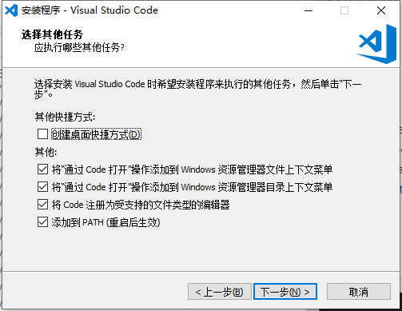

> 大家会在程序设计课会用到一个C/C++的IDE，叫做Visual Studio（简称VS）。它和这里的VSCode有什么关系呢？——它们都是微软的。但VS是IDE，VSCode是编辑器。

#### 1.3.2 插件安装
目前，我们刚安装好的VSCode只是一个还算不错的编辑器而已。它能流行的真正原因，在于官方以及各路程序猿们合伙给它开发的插件上。接下来，我们来给我们的VSCode安装一下插件，使得它能接近PyCharm的编辑体验。

首先，我们打开VSCode，然后点击下图中红框标出的按钮，进入插件商店。如果VSCode的版本比较老，那么可以在差不多的位置找到一个长得差不多的按钮。勇敢地点一下吧，反正也不会导致电脑爆炸。

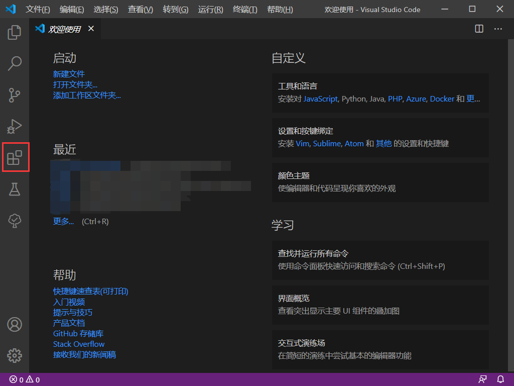

大家刚打开的VSCode应该是英文界面，而不是中文的。所以我们先来安装一下中文环境。在下图所示的插件商店搜索栏中搜索“Chinese”，然后能看到由微软开发的“中文(简体)"插件。接着，请点击右下角的“安装”按钮进行安装。安装完成后VSCode可能会提醒你重新打开它。

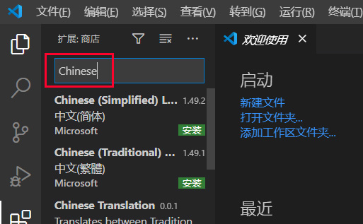

接下来，用同样的方法，我们在插件商店的搜索栏中搜索“Python”，然后安装下图中第一个还是由微软开发的Python插件。图中是已经安装好的样子。

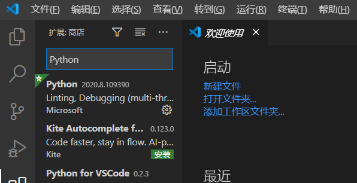

以上就是我们实验中所需要的最好用的两个插件。大家可以在未来根据自己的需求不断添加新的插件打造你的“最强编辑器”。

#### 1.3.3 怎么运行代码？
对了，善于思考的同学可能会问，“现在我们知道没有IDE的时候程序猿们是怎么编辑代码了，但他们又是怎么运行代码的呢？”。先给个答案：程序猿们在“终端”上使用“命令”来运行代码。什么是终端？什么又是命令？想象一下我们在开头提过的影视作品里黑客们的例子。有没有一些感觉呢？马上我们就会教给大家这些东西。

### 1.4 小结
到现在，同学们应该已经完成了以下内容：
- 安装好了Python环境。
- 安装好了PyCharm或者VSCode。
- （可选）知道了“原始”的程序猿使用类似记事本、VSCode的编辑器来编写程序，并使用终端和命令来运行程序。从而知道了IDE（比如PyCharm，以及程序设计课会用到的VS）无非是把这些功能整合在一起的软件。它并不神秘。

## 2. 终端与命令

使用终端（Terminal）和命令（Command）来运行程序是最“原始”但依旧有用的方式，并且同学们将在日后的课程实验中经常使用它。因此在这一节中，我们来认识终端，并学习如何在终端上执行一个简单的命令。

### 2.1 打开终端

- **Windows系统**：考虑到本课程的实验仅需最简单的终端命令，我们以Windows系统内置的“命令提示符”为例。首先敲击快捷键`Win + R`，然后会弹出下图所示的窗口。

  

  接着，在输入栏中输入`cmd.exe`，按回车键执行。若见到如下的终端界面，便说明成功打开了Windows的终端。

  

- **macOS系统**：在Apple官网能找到[《终端使用手册》](https://support.apple.com/zh-cn/guide/terminal/apd5265185d-f365-44cb-8b09-71a064a42125/mac)在访达（Finder）的”应用程序/实用工具“目录中寻找”终端“（或”Terminal“），打开即可。也可以点击程序坞的”启动台”图标，在搜索栏中键入“终端”，然后点击“终端”。

- **Linux系统**：在桌面或文件夹界面右击，在下拉框中选择“Open in terminal”，就能打开终端。也可以利用快捷键`Ctrl + Alt + T`打开。

> 到底什么是“终端”？终端本质上就是一个“显示器”——它只有显示的功能。然而，当你打开终端后，你会在终端上看到一些字符，并且敲击键盘会在终端上显示你敲击的字符。实际上，这是由一个叫“cmd.exe”的程序完成的（在Windows平台上是这样的。在Linux和macOS上对应的程序叫Shell）。cmd.exe是你最贴心的电脑管家。你可以通过输入“命令”来让它帮你在电脑上执行程序，并把结果输出到终端上。马上我们就知道如何让它执行一些命令了。
> 
> 有的人可能想知道，为什么大家看到的终端是这样黑漆漆的一片、只显示了一些看起来很枯燥的文本呢？因为古早的电脑就是这样的。就像下面图片里这样。古早的电脑的显示器就是终端，又因为显示器没有像现代发达的图形显示能力，所以只能用最简单的方法显示信息——黑漆漆的背景、像素风格的文字。而当拥有图形界面的操作系统（如Windows）开始流行后，显示器被好看的图形界面了占用了，终端需要靠软件模拟才能打开。又因为前面所说的历史因素，模拟出来的终端就保持了这样有点丑的“小黑框”风格。
> 
> 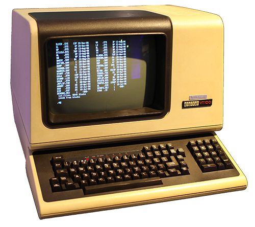
>
> 未来我们提及终端的时候，更多指的是终端的那个“小黑框”外加上cmd.exe（或Shell）这个程序所组成的整体。如果现在大家不是那么明白也没关系，只要知道如何打开终端即可。

### 2.2 认识终端

打开终端后，我们首先来理解一下终端上显示的到底是什么，再来学习如何让终端执行我们的“命令”。

以Windows为例，当你打开终端后，你可能会看到终端上显示着下面这样的文字：

  

首先前面两行是关于微软的一些信息，我们不用管它。然后终端的第四行显示了这样一段文字：

    C:\Users\Dell>

我们把这串字符称为“提示符”（Prompt），它本身代表了一些当前系统的信息，并“提示”你，终端正在待命，你可以在光标处输入命令！那这串提示符的信息该怎么理解？我们可以把它分解为两个部分：

- 第一部分“`C:\Users\Dell`”表示终端的“当前工作目录”。这个概念我们会在后面讲解。
- 第二部分是“`>`”，一个比较形象的符号来提醒你在它后面可以输入命令了。Linux和macOS上默认会用“`$`”这个符号。

另外，提示符的格式是可以自定义的。每个平台都可能有不同的格式。所以我们再以macOS为例，看看macOS上的提示符是什么样的。如下图所示。

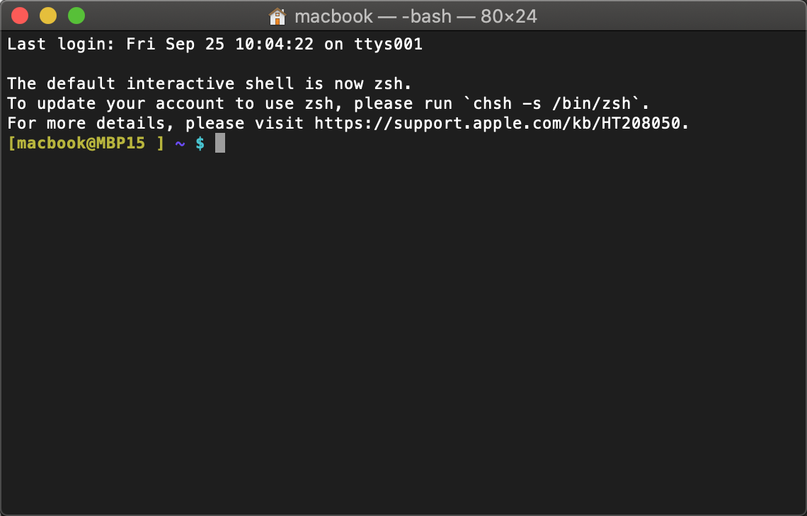

可以看到，图中的第一行是用户登录终端的时间等信息，接下来几行白字是关于Shell的信息。同学们的终端可能不会显示这些信息，不用在意。比较重要的是最后一行：

    [macbook@MBP15 ] ~ $

这串字符是macOS上的提示符，它的格式是这样的：在`@`符号之前的是你的用户名（在助教的电脑里用户名是`macbook`），在`@`符号之后的是电脑的名称（此处为`MBP15`）。紧接着，`~`看似陌生，实际上就是类似于前面介绍的Windows中的`C:\Users\Dell`这样的用户目录，让我们看一看macOS的`~`在哪儿？打开macOS的“访达”（相当于Windows的文件管理器），点击左侧框中“位置”下方你的电脑名称


可以看到一个带有磁盘图标的“文件夹”，双击打开。

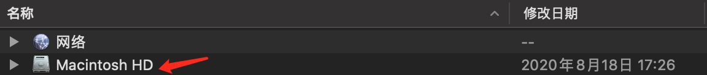

接着双击“用户”（Users）。

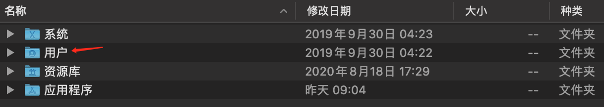

这时我们就可以看见自己的用户名出现在了访达里面，双击它！随后看到的文件夹界面便是和前面在终端中演示的`~`目录一致的。也就是说，macOS终端默认打开后的“当前工作目录”（`~`），其实就是`/Users/macbook`这个目录的“绰号”，具体的概念我们同样会在稍后讲解。

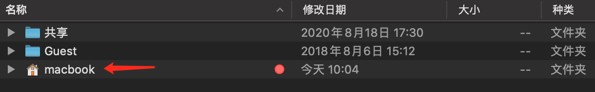

关于macOS的Terminal，官网提供了一些便捷的[使用技巧](https://support.apple.com/zh-cn/guide/terminal/trml106/2.9/mac/10.14)，不妨看一看、试一试。

### 2.3 执行命令

现在，大家应该理解了“提示符”的含义。接下来我们就可以试试在终端上输入命令执行了。我们首先输入一个简单的命令来看看Python是否安装成功！如下图所示，请大家向终端敲入命令：`python --version`，然后按下回车键。马上就可以看到，终端执行了这个命令，并把结果“Python 3.7.1”输出到了屏幕上——这代表助教所安装的Python的版本是3.7.1。大家看到的结果不必和助教这边显示的相同，只要保证显示的版本号是`Python 3.x.y`的格式即可。大家还可以看到，终端又在最下方输出了一行提示符，提示大家可以输入新的命令了！

> 在Windows上，请大家优先使用`python`命令。如果没有类似上图所显示的效果，再尝试用`python3`命令试试。如果这样还不行，那么请询问助教。在macOS和Linux上，大家可以优先使用`python3`这个命令。在以后的演示中，助教可能会因为操作系统不同，分别采用不同的命令做演示。大家需要根据自己的操作系统作调整。

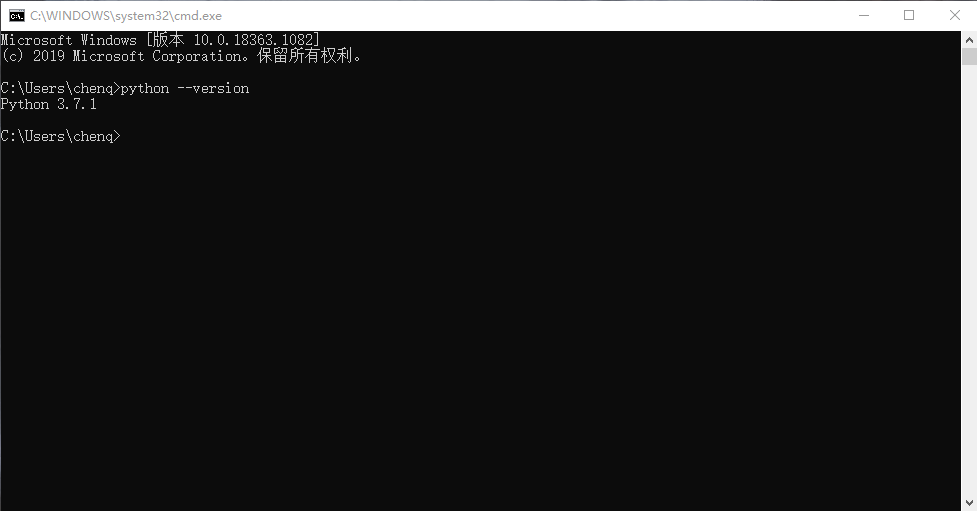

在以后，我们会避免使用图片来显示命令的运行结果，而更喜欢使用文本的方式来显示（这也方便大家复制粘贴）。比如，在刚才输入`python --version`命令来查看Python安装是否成功的例子中，我们现在会像下面这样来展示大家应该看到的结果：

    $ python --version
    Python 3.7.1
    
    $

**需要注意的是，为了减少视觉负担，我们还使用了“`$`”这一简短的符号来代替原本图片中一长串的提示符。未来大家会在网络上看到更多这样的表达。**

**此外，以后我们在演示输入任何命令时，大家都不要把提示符也敲进去！提示符是交互程序打印在终端上给你看的！**

## 3. Python基础

现在，我们已经了解了如何打开终端并让终端执行命令。接下来，我们就可以正式开始学习Python了！

抽象地来讲，Python代码主要由**表达式**（Expression）和**语句**（Statement）组成。而为了执行程序员编写的Python代码，有一个叫**Python解释器**（Python Interpreter）的软件来负责一行一行地读取Python代码来执行。

一方面，我们能把Python代码都写在文件中，让Python解释器从文件中读取代码执行。另一方面，Python解释器有一个“交互模式”，能支持我们以交互的方式在终端上一行一行地向Python解释器输入Python代码，来即时地查看相应的执行结果。如果你把某个Python文件中的代码复制到Python解释器的交互模式中执行，那么得到的结果应该是和解释器直接执行这个Python文件的结果是一致的！

所以，在这一节中，我们首先讲解Python解释器的“交互模式”，然后在交互模式中给大家展示Python代码（即表达式和语句）的执行结果。最后，我们教大家在文件中编写Python代码，并使用Python解释器执行它。

### 3.1 与Python解释器进行交互

刚才我们说过，Python解释器是用来执行Python代码的软件。Python解释器除了能读取文件中的代码执行，也支持在终端上读取我们输入的表达式和语句执行并展示结果——这很方便大家学习Python。我们来看看如何启动Python解释器的“交互模式”。

在打开的终端中，我们可以直接用键盘输入`python`（或者`python3`）这个命令，然后按一下回车键启动Python解释器的交互模式界面。效果如下图所示：

    $ python
    Python 3.7.1 (default, Dec 10 2018, 22:54:23) [MSC v.1915 64 bit (AMD64)] :: Anaconda, Inc. on win32
    Type "help", "copyright", "credits" or "license" for more information.
    >>>

大家很可能看不懂执行`python`命令后终端所显示的内容。不过不用慌，我们带大家分析一下上面的每串字符。首先是第一和第二行

    Python 3.7.1 (default, Dec 10 2018, 22:54:23) [MSC v.1915 64 bit (AMD64)] :: Anaconda, Inc. on win32
    Type "help", "copyright", "credits" or "license" for more information.

这是Python解释器开始运行交互模式后打印的一些信息，比如第一行打头的“Python 3.7.1”这个版本号。我们不必在意。大家终端上显示的信息不必和这里展示的信息完全一致，但版本号必须是`3.x.y`的形式。

> 还记得我们之前通过`python --version`来查看Python版本号吗？

接着，Python解释器在第四行显示了“`>>>`”这个符号。这个符号也是提示符，只不过没先前终端显示的提示符那么长。它代表了我们可以输入一些“东西”跟Python交互了。对于终端来说，大家能在终端的提示符后面输入命令来让终端完成；而对于Python解释器来说，大家能在提示符`>>>`后面输入表达式与语句来让Python解释器帮你做计算。

作为一个例子，我们现在可以在提示符`>>>`后面输入`1 + 1`，按下回车键，看看Python会不会计算这个小学生都会算的事情。结果如下：

    $ python
    Python 3.7.1 (default, Dec 10 2018, 22:54:23) [MSC v.1915 64 bit (AMD64)] :: Anaconda, Inc. on win32
    Type "help", "copyright", "credits" or "license" for more information.
    >>> 1 + 1
    2
    >>>

可以看到，Python解释器很灵性地计算了`1 + 1`，得到`2`，并把`2`输出给你看，然后很积极地再打出了提示符`>>>`，提醒你输入下一个表达式或语句来让它计算。概言之，交互模式便是一种“你输入表达式或语句，Python解释器执行它，你再输入表达式或语句，Python解释器再执行它……”的重复过程，直到你不想再和Python解释器说话，敲入`exit()`为止（见3.3节），交互模式就结束了。

在本小节的最后，让我们来比较一下和Python解释器交互以及和终端交互时两者提示符的区别吧。和Python交互时的提示符是`>>>`，而和终端交互的提示符是`>`（在Linux和macOS则是`$`）并且在前面往往有表示“当前工作目录”的文字。大家要注意区分这两种模式——既不能在和Python交互时输入只有终端才能懂的命令，比如`python hello.py`，也不能在和终端交互时输入只有Python解释器才能懂的表达式或语句，比如`1 + 1`。

### 3.2 表达式与语句

接下来，我们来正式学习一下表达式和语句的概念，并在Python解释器的交互模式中来检查它们的执行结果。

大家在高中阶段一定见过`8 * 8`, `a + b `, `7 - (x + y)`之类的数学表达式，而程序表达式也是类似的，它们由数字（亦称为常数）、变量(如`a`, `x`等，用字母表示)、运算符（如加法、乘法符号等）等组成，一些表达式还包含了函数，这在课上会讲到（不妨试着用数学里的“函数”概念去理解它）。我们知道，如果表达式里面每个部分的值都是已知的（例如，`a + b`中`a`的值为4、`b`的值为5），那么整个表达式就可以被**求值**。让我们来看看Python里面的表达式和求值是什么样的。

#### 3.2.1 基本表达式

基本表达式（Primitive Expressions）只需要一步便可以求得它的值，例如整数、浮点数和布尔值：

    >>> 3
    3
    >>> 12.5
    12.5
    >>> True
    True

同学们可以像上面这样在交互模式下输入表达式，并按回车键查看结果。

> 浮点数是一种带小数点的数。之所以叫它浮点数，是因为它和计算机底层的表示有关。等大家上《计算机系统基础》这门课的时候就会理解了。

变量名同样也是基本表达式，求值的结果为在当前程序的状态下绑定到的值（更多内容见赋值语句）。

#### 3.2.2 布尔值与布尔表达式

布尔值只有两种值，`True`和`False`，表示逻辑上的“真”与“假”。例如，我们知道数字`1`是不等于`2`的，所以若在Python交互模式中输入`1 == 2`（这个表达式意思是“1等于2”，在Python中一般用`==`表示“相等”），则会得到它的值为`False`；相反，如果输入`1 != 2`（表示”1不等于2“，在Python中一般用`!=`表示”不相等“），则会得到值`True`。这种能计算出布尔值的表达式我们称之为布尔表达式（Boolean Expression）。

```
>>> 1 == 2
False
>>> 1 != 2
True
```

#### 3.2.3 算术表达式

可以通过对数字和数学运算符的组合产生复杂的算术表达式（Arithmetic Expression）。Python中常见的数学运算有`+`(加)、`-`(减)、`*`(乘)、`**`(乘方)和以下三种：
- 浮点除法 (/)：计算第一个数除以第二个数的结果，得到一个浮点数（即使能够整除）。
- 下取整除法 (//)：计算第一个数除以第二个数的下取整后的结果，得到一个整数。
- 取模 (%)：计算第一个数除以第二个数的余数(>0), 得到一个整数。

```
>>> 1 + 2
3
>>> 3 - 2
1
>>> 5 * 6
30
>>> 7 / 4
1.75
>>> 7 // 4
1
>>> 7 % 4
3
>>> 4**3
64
```

像大家平时学过的数学运算一样，算数操作也有优先级，比如乘方运算的优先级大于乘除运算，乘除运算的优先级大于加减运算。同样地，你也可以通过“加括号”来改变求值优先级。注意，优先级不需要记忆。当你对运算优先级拿不准的时候，就多加括号！

    >>> 2 + 6 / 4
    3.5
    >>> (2 + 6) / 4
    2.0

#### 3.2.4 赋值语句

一个赋值语句（Assignment Statement）由一个变量名和一个表达式组成。它会在当前帧（帧的概念后续课程会讲）下把变量名与该表达式的值绑定。

    >>> a = (100 + 50) // 2

注意不能对语句进行求值。

你可以输入一个之前定义过的变量名，例如`a`，Python解释器会输出其绑定到的值。如果你还记得之前的内容，a也是一个基本表达式：

    >>> a
    75

注意这里`a`被绑定到`75`, 而非`(100 + 50) // 2` —— 变量名绑定到值而非表达式上。

#### 3.2.5 print

`print()`是Python3的内置函数，它可以将一个表达式的值输出到终端上（如果还不清楚函数的概念，就单纯记忆一下它的用法吧）。`print(2020)`也是一条语句：

    >>> 2020
    2020
    >>> print(2020)
    2020

注意，上面在交互模式下输入`2020`和`print(2020)`显示的结果看上去相同，但前者是交互模式下自动输出的每一行表达式的值，后者是`print()`在终端中的输出。在非交互模式下（即执行Python代码时，后面会讲），如果你想知道结果，请用`print()`。

### 3.3 退出交互

当你完成与Python的交互后，可以输入`exit()`并回车或按下`Ctrl+Z` (Windows/Linux) / `Command+Z` (macOS)退出交互窗口。


可以看到，你的终端不再显示Python的提示符，而是显示了自己的提示符。这说明你又可以向终端（而不是向Python交互界面）输入新的命令了。

### 3.4 执行Python文件

大家已经知道，Python代码是由表达式和语句组成的。而现在大家已经学会了一些简单的表达式和语句，并在交互模式下体验了执行它们的效果。现在，我们就可以把之前学过的表达式和语句都写入到文件中，然后让Python解释器直接从文件中读取它们并执行。

关于编写代码，我们已经事先准备了一个编写好的文件`code/hello.py`（约定俗成，大家以`.py`的后缀来表示这是一个Python代码文件）。这个文件中有下面内容：

    2020
    print(2020)

你也可以利用任何任何文本编辑器修改`hello.py`，尝试前面提到的其它表达式和语句，或者试一试其它你感兴趣的内容。后面我们会教大家如何用PyCharm修改它。

接下来，你需要打开终端，然后输入`python 文件名`（或`python3 文件名`）命令来执行这个Python代码文件。在这里，你需要输入：

    $ python hello.py

然后可以得到结果

    2020

但多半你会发现出了错误！请往下看下一小节。

> 但另外，你可能还会疑惑为什么只显示了一个2020。现在你需要回顾一下前面3.2.5小节的内容。你会发现，原来`2020`这种表达式仅会在交互模式下显示求值结果。这里不是交互模式，所以表达式`2020`没有显示任何结果。屏幕上的2020是由print函数“打印”出来的（难怪它叫print）！

### 3.5 文件查找与当前工作目录的切换

在执行`python hello.py`时，大家有可能会看到终端上显示出错误：

    $ python hello.py
    python: can't open file 'hello.py': [Errno 2] No such file or directory。

这和Python解释器的文件查找机制有关。

大家还记得先前提到的“当前工作目录”的概念吗。不记得了可以跳回2.2节去看一眼：终端会在提示符里面显示当前的工作目录。而当你键入`python hello.py`时，Python解释器会在当前的工作目录里去找`hello.py`并执行。而如果你当前工作目录下没有`hello.py`文件时，Python解释器就会报错了。

举个错误的例子：假设你有一个文件夹叫做`C:\SICP`，并且你把我们下发的实验材料的压缩包解压在了这个文件夹中，也就是说你的实验材料都在`C:\SICP\lab00`下。但是你打开终端的时候，默认的当前工作目录可能是`C:\User\Dell`（在你的电脑上可能是其它工作目录），而现在你知道`hello.py`在`C:\SICP\lab00\code`目录下，那么当你执行

    C:\User\Dell>python hello.py

就会出现问题。但如果你当前的工作目录是`C:\SICP\lab00\code`，那么你执行

    C:\SICP\lab00\code>python hello.py

就不会有任何问题。那么接下来你就会问，该如何改变当前的工作目录呢？你可以通过`cd`这个命令切换终端的当前工作目录！

> `cd`的全称是change directory。

一方面，你可以通过`cd`后跟一个目录的“绝对路径”来把工作目录切换成“绝对路径”所表示的目录。比如在上面的例子中，如果你当前的工作目录是`C:\User\Dell`，那么你可以像下面这样切换当前的工作目录到`C:\SICP\lab00\code`：

    C:\User\Dell>cd C:\SICP\lab00\code
    C:\SICP\lab00\code>

> 什么是绝对路径？像`C:\SICP\lab00\code`以盘符（C盘的盘符叫做`C:`，D盘的盘符叫做`D:`，以此类推）开头的路径，就叫做绝对路径。否则叫相对路径。

另一方面，你也可以通过`cd`后跟一个目录的“相对路径”来把工作目录切换成“相对路径”所表示的目录。比如，如果你当前的工作目录为`C:\SICP\lab00`，并且这个目录下还有一个`code`目录，那么你可以像这改变当前的工作目录：

    C:\SICP\lab00>cd code
    C:\SICP\lab00\code>

这里的`code`就是相对路径。这个过程就很像你在资源管理器的lab00目录下双击了code目录，然后就进入了lab00\code目录一样。如果你的`C:\SICP\lab00`下没有`code`目录，那么终端上就会显示错误。你可能需要打开资源管理器看看是怎么回事。

接下来你可能会想知道如何回到上一级目录或者切换磁盘。下面是一些演示：

- “`..`”的含义为上一级目录。“`.`”的含义为当前目录。可以使用`cd a\b\c`这样的形式一口气进入多层目录（`a\b\c`就是所谓的相对路径）。“`#`”及后面的文字表示注释说明。

        C:\SICP\lab00\code>cd ..      # 进入上层目录
        C:\SICP\lab00>cd ..           # 再次进入上层目录
        C:\SICP>cd lab00\code         # 进入lab00目录下的code目录
        C:\SICP\lab00\code>cd ..\..   # 进入上层目录的上层目录
        C:\SICP>cd .\lab00            # 进入当前目录的lab00目录
        C:\SICP\lab00>cd ..\lab00     # 进入上层目录的lab00目录 (即还是当前目录)
        C:\SICP\lab00>

- 在Windows上，如果当前目录的盘符与目标目录的盘符不同，你首先需要通过"{盘符}:"命令切换盘符。

        C:\SICP\lab00>cd D:\NJU    # 无效的切换
        C:\SICP\lab00>D:           # 有效的切换
        D:\NJU>

- Windows的路径不区分大小写，但是Linux和MacOS均区分。
- Windows上路径的目录之间使用“`\`”分割，而Linux和MacOS则使用“`/`”分割。

#### 3.5.1 当前工作目录下的有哪些目录与文件?（可选）

你可以通过`dir`命令（在Windows上）或`ls`命令（在Linux/MacOS上）显示当前目录下的文件。例如，在Windows下：

    C:\SICP\lab00\code>dir
     驱动器 C 中的卷是 Windows
     卷的序列号是 4C0F-CDB0
    
     C:\SICP\lab00\code 的目录
    
    2020/09/21  10:37    <DIR>          .
    2020/09/21  10:37    <DIR>          ..
    2020/09/21  15:03                19 hello.py
    2020/09/19  17:48               480 lab00.py
                2 个文件            499 字节
                3 个目录 100,005,732,352 可用字节
    
    C:\SICP\lab00\code>

在Linux下：

    ~\SICP\lab00\code$ ls
    hello.py lab00.py
    ~\SICP\lab00\code$

#### 3.5.2 命令的格式（可选）

现在，大家应该已经执行过很多命令了。接下来，我们带好奇的同学总结一下命令的通用格式是什么样的。

一般来说，命令的格式如下：

    $ executable [-option [parameter]]... [positional-parameter]...

- executable是一个可执行文件，比如在命令`python --version`中，executable就是`python`——它正是我们在第一节配置Python环境中所下载的可执行文件。
- `[-option [parameter]]...`的中括号表示“可选”，省略号表示零个或多个。它们加起来的意思是，executable后面可以跟零个或多个形如`-option [parameter]`这样的东西，其中`-option`代表一个选项，`-option [parameter]`代表选项后面可以跟一个可选的`parameter`，这视具体的选项而定——有的选项需要`parameter`，有的就不需要。
- `[positional-parameter]...`代表零个或多个`positional-parameter`。这种`positional-parameter`与`-option parameter`中`parameter`的区别是，它不会跟在选项后面。

下面举几个例子就容易理解了：
- 在`python --version`这个命令中，`--version`就是一个形如`-option`的选项——这个选项的意思是叫`python`这个可执行程序打印它的版本号。此外，`--version`后面不需要跟`parameter`。
- 在`cd C:\SICP\lab00`这个命令中，`cd`概念上也是一个可执行文件。而且它后面没有任何形如`-option [parameter]`这样的东西。但是有一个绝对路径`C:\SICP\lab00`作为`positional-parameter`。这表示把当前的目录切换到`C:\SICP\lab00`。
- 在`python lab00.py`这个命令中，没有任何形如`-option [parameter]`这样的东西。但是有个`positional-parameter`——`lab00.py`。这个命令表示启动Python解释器去执行`lab00.py`里的代码。
- 在`python -i lab00.py`这个命令中（将在4.3节出现），有一个`-i`选项。注意，这里的`lab00.py`不是`-i`的`parameter`，而是`positional-parameter`——因为`-i`选项后不需要`parameter`。在多了一个`-i`选项后，这个命令就比前面讲解的`python lab00.py`多了些功能——除了要像`python lab00.py`一样启动Python解释器去执行`lab00.py`里的代码，还要让Python解释器执行完毕后进入交互模式，而不是直接退出Python解释器。
- 在`python -m doctest lab00.py`这个命令中（将在4.3节出现），有一个`-m`选项。在这里，`doctest`确实是`-m`的`parameter`。回顾一下，`-m doctest`是一个形如`-option [parameter]`的东西。另外，这里的`lab00.py`依旧是`positional-parameter`。在多了一个`-m doctest`后，这个命令比起前面两个命令的含义又产生了变化——`Python`解释器要启动`doctest`模块去执行`lab00.py`里的`doctest`。

此外，`-option`一般有两种约定俗成的形式：
  - 一种是像“--version”这样的由两个连字符加上一个单词的形式。这种形式长得很“长”，方便理解。
  - 一种是像“-i”这样的由一个连字符加上字母（一般是某个单词的首字母）的形式。这种形式长得很“短”，方便输入。

### 3.6 如何用PyCharm做以上这些事情？

在理解了Python代码的交互执行与文件执行方法之后，我们把视线移回辛辛苦苦安装好的PyCharm。前面大家输入了那么多命令，不知道是觉得很酷炫，还是觉得很麻烦？但至少，PyCharm会让大家更轻松点。

在编写程序方面，相比于最普通的记事本，PyCharm最明显的好处是——时常可以提醒你代码哪儿可能写错了，而且可以用不同的高亮颜色区分程序的各个不同部分，减轻你的视觉负担，再加上便捷的代码调试、代码跳转等功能，让你的实验时间骤减！当你通过逐步探索而更加熟悉PyCharm时，它会更显著地提高你的编程效率，成为你的~~好伴侣~~。

每次实验发布时，都会附带一个包含实验框架代码的文件夹。我们怎样在PyCharm里打开它，以便于编写和运行里面的程序呢？

#### 3.6.1 PyCharm导入和运行已有的Python文件

1. 首先我们双击已安装的PyCharm Community软件，启动后有界面主题配置，选择自己喜欢的主题即可，无需安装其他插件。随后大家会看到如下所示的欢迎界面，点击“Open”，寻找实验代码所在的文件夹（例如，本次实验我们要完成的函数都在文件`lab00.py`中，它所在的文件夹为`code`，那么我们就点击`code`文件夹，然后点击右下角的“OK”），PyCharm会为这个文件夹自动创建一个项目，它包含着所有实验文件。

   

2. 在打开项目后，双击左边的`hello.py`文件，此时大家就可以看到`hello.py`这个文件的内容已成功地显示在PyCharm主界面中（图中`hello.py`的内容仅为演示使用，不代表最终版发给大家的`hello.py`的内容）。

   

3. 下面我们要运行`hello.py`这个文件，看看它的结果能否和终端运行一样。点击上方菜单栏的“Run”，选择下拉框中的“Run”，可以看到一个提示框。单击`hello`（表示运行`hello.py`这个程序），就可以看到输出结果`2020`显示在了下面的运行栏中。

   

   

   

#### 3.6.2 在PyCharm中打开终端

如果想在PyCharm里使用先前介绍的终端，我们可以看见界面下方有个"Terminal"按钮，点击即可在PyCharm界面里打开我们先前讲解过的终端，输入`python`便可进入Python交互模式，像先前讲解过的一样玩转Python！比如，你可以在终端输入命令`python hello.py`来执行`hello.py`程序，这也是刚刚提到的PyCharm运行方式的一种替代方法。


### 3.7 如何用VSCode做以上这些事情？（可选）

对于之前选择VSCode的同学，我们现在来看看如何用VSCode打开文件、打开目录和打开终端。因为VSCode是个轻量的编辑器，所以你会发现，相比于PyCharm的流程，VSCode会更简单。

#### 3.7.1 打开文件
我们可以像标准的编辑器一样（比如记事本）直接右击文件、选择“通过Code打开”来打开文件。如下图所示，我们演示了在实验代码的code目录下用VSCode打开`hello.py`文件。

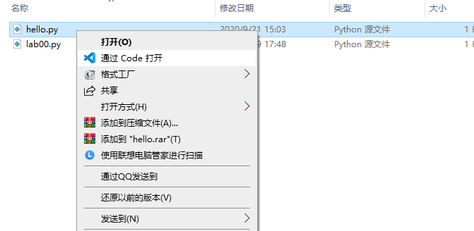

如果你在安装VSCode的时候没有勾选`将"通过Code打开"操作添加到Windows资源管理器文件上下文菜单`这一选项，就比较麻烦了。请自己探索如何打开文件吧。

#### 3.7.2 打开目录
VSCode有一个“打开目录”的概念。比如，一个项目可能由多个代码文件组成放在一个目录下。我们希望“打开这个目录”，然后自由选择打开目录下的文件。解释起来可能有点难理解，但操作几下就很容易明白了。

如下图所示，依旧在code目录下，我们右击空白处，选择“通过Code打开”来打开code目录。打开以后，你会发现VSCode左侧多了个文件列表。你可以点击文件来打开你想要的文件。可以说，“打开目录”这个概念很像是PyCharm中的打开项目的概念。

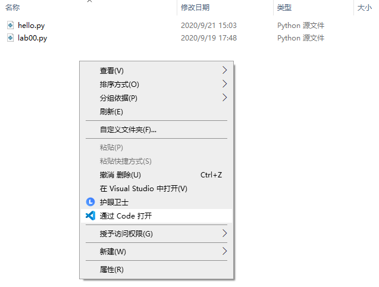

如果你在安装VSCode的时候没有勾选`将"通过Code打开"操作添加到Windows资源管理器目录上下文菜单`这一选项，就比较麻烦了。请自己探索如何打开目录吧。

#### 3.7.3 打开终端

你可以通过快捷键 ``Ctrl+` `` 来打开终端。如果你先前通过“打开目录”来打开了VSCode，那么终端的工作目录即是你刚才所打开的目录。现在，你可以在终端上进行之前我们教过的任何操作了，比如与Python解释器交互、启动Python解释器运行Python代码。

### 3.8 小结
在第2和第3小节中，同学们应该已经完成了以下内容：
- 掌握了终端的基本概念：
  - 如何打开终端。
  - 终端上的提示符的含义。
- 掌握了如何在终端下执行命令：
  - 使用`cd`命令来切换终端的当前工作目录。
  - 使用`python`相关的命令来：
    - 进入Python解释器的交互模式，执行简单的表达式和语句，以及退出交互；
    - 启动Python解释器来执行`.py`代码文件。
  - （可选）知道了命令的一般格式。
- 掌握了使用PyCharm来：
  - 打Python项目和文件
  - 点击鼠标来执行`.py`代码文件
  - 打开终端
- （可选）掌握了使用VSCode来：
  - 打开目录和文件
  - 打开终端

## 4. 如何完成实验？

现在，大家应该熟悉了如何用Python编写代码以及运行代码的过程。那接下来，我们就要讲解大家可能最不愿意看到的东西了——如何完成实验？

在我们的课程实验中，大家需要补充作业文件中的函数定义来完成一些题目（暂时不知道函数是什么也没关系）。我们实验的作业文件一般会放在code目录下，随实验讲义一起发布给大家。不要担心。我们首先带大家一起完成一道题目来熟悉这个流程。

### 4.1 作业文件
本次实验的作业文件是`code/lab00.py`。大家可以使用编辑器或者PyCharm打开它。打开`lab00.py`后，我们首先能看到下面这段代码：

    def twenty_twenty():
        """Come up with the most creative expression that evaluates to 2020,
        using only numbers and the +, *, and - operators.
    
        >>> twenty_twenty()
        2020
        """
        return ______

上面代码里包含了我们将要完成的第一个题目——2020（这个题目就叫做2020）。看到上面的代码时，你可能是一脸懵逼的。不过不要慌，我们来一步一步理解。

首先，这段代码使用`def twenty_twenty()`定义了一个函数`twenty_twenty`。如果在实验课前老师还没讲如何定义函数，大家也不用着急。不知道这个知识点也能完成本次实验。不过，在下一次课上你应该就会学到如何定义函数了。

接下来，我们会看到一段被三引号`"""`包围的文本。我们把这段文本叫做**docstring**（全称document string，即文档字符串）。它一般被用来描述一个函数应该做什么。在我们`twenty_twenty`的例子中，这段docstring告诉我们：“写出一个富有创造力的表达式，使得计算它的值能得到2020”（当然，在本次实验中没那么有创造力也无妨）。此外，它还要求我们只可以使用数字和加减乘除。

紧接着，我们能看到有一行docstring是以“`>>>`”开头的。从这行开始往下的docstring被叫做**doctest** (举一反三一下，它的全称为什么？——document test)。回想一下大家在前面使用的Python交互模式，“`>>>`”被我们称为提示符——它告诉我们可以在它后面输入表达式或者语句。是不是当你在“`>>>`”后面输入一个表达式后，Python解释器就会在下一行打印这个表达式的值？doctest就是通过这样的示例来告诉你一个函数会做什么：“当我们在交互模式下这样输入代码，就会得到这样的结果”。在我们`twenty_twenty`的例子中，doctest告诉我们：“当我们在交互模式下输入`twenty_twenty()`，就会得到`2020`”。

总的来说，docstring和doctest分别使用“描述”和“举例”的手段来告诉我们一个函数的行为。未来在大家完成实验题目的时候，除了阅读实验讲义，也最好读一读它们加深自己的理解。

> 在实验中，你不需要修改任何docstring，除非你想添加自己的doctest。你可能会问“我为什么会想添加自己的doctest？”。继续读下去就知道了。

### 4.2 写点代码
现在，我们应该理解了作业文件中的第一个题目，即写一个(有创造力的)表达式，使得它的值为2020。

那么我们该把这个表达式写在哪里呢？我们的实验讲义会把这种要求都描述清楚。本次实验其它题目的描述可以在下面的“本次实验内容”一节中找到。作为一个带大家一起做的例子，我们现在先告诉大家第一个题目的要求：**请用你想到的那个表达式替换掉`twenty_twenty`中下划线的部分。**

当然，我们之前说过第一个题目我们会带大家一起做。所以虽然不知道富有创造力的大家想到了什么表达式，但没有创造力的助教们就想了一个这样的答案：

    def twenty_twenty():
        """Come up with the most creative expression that evaluates to 2020,
        using only numbers and the +, *, and - operators.
    
        >>> twenty_twenty()
        2020
        """
        return 2019 + 1

大家可以修改各自得到的`lab00.py`文件，把下划线替换成自己想到的表达式。

### 4.3 我实现的对不对？
现在，大家已经完成了第一个题目。这个题目当然是很简单的，但之后随着知识的增多，我们要完成的题目也越发复杂。那么有没有什么方法能检验我们写的代码对不对呢？

回想一下，doctest描述了“当我们在交互模式下这样输入代码，就会得到这样的结果”，那么我们是不是可以打开交互模式，按照doctest的描述输入代码，然后观察结果是不是一致的呢？

答案是肯定的。我们首先打开终端（不管是从PyCharm里打开，还是直接运行cmd.exe），然后使用`cd`命令把当前目录切换到`lab00.py`所在的目录下（回忆一下实验讲义前面教你如何切换当前目录）。然后输入`python -i lab00.py`。这个命令长得和我们在前面学过的`python lab00.py`很像，但多了个`-i`。`-i`是告诉Python，在使用`python lab00.py`执行完`lab00.py`后，进入交互模式。而开发Python的程序员之所以采用`i`这个字母，是因为它是interactive(交互)的首字母，方便记忆。现在让我们执行`python -i lab00.py`。你应该能在终端上看到下面的效果：

    $ python -i lab00.py
    >>>

接下来的过程就和交互模式一模一样了。你可以对照着doctest，输入`twenty_twenty()`，然后就会得到

    $ python -i lab00.py
    >>> twenty_twenty()
    2020
    >>>

这和doctest描述的一模一样，所以你现在可以松口气，相信自己的代码是对的了。如果发现不一样，你就需要看看自己哪里出问题了。

等一等！刚才其实有一个概念的陷阱。现在让我们思考一个问题：为什么说，经过刚才这样一个过程，我们就有理由相信我们的代码是对的呢？

实际上，“相信自己的代码是对的”是一个错误的说法！准确的说，大家只能有理由相信“自己写的代码和doctest所预期的相符合”，进而推论，自己的代码**可能**是对的。

其实，像这样一个比较代码的实际执行结果和预期结果的过程就叫做**测试**。这也是“doctest”中test的中文含义。测试不能保证“代码是对的”，只能保证代码在多大程度上与预期相符合。与预期符合得程度越高，我们就更加有信心来相信，我们的代码是对的。

> 实际上，还有一种检查程序正确的方式叫做形式化验证（Formal Verification），通过规则和逻辑（而非测试样本）来判断程序的正确性。这正是冯新宇老师研究的领域之一。在你之后的学习过程中可能还会进一步接触相关内容。

对于助教来说，很难一一审查每个人的代码来验证大家写得正不正确，所以我们会采用测试的方法来给大家评分。像我们发布给同学的doctest一般都写得比较简单，所以那些写得不正确的代码也有可能通过doctest，比如像下面这段代码，本来助教希望大家写`return a + b`，但有个小机灵鬼直接返回3试图蒙混过关：

    def add(a, b):
        """return the sum of a and b
    
        >>> add(1, 2)
        3
        """
        return 3

但如果我们的测试写得越“详细”，写得不正确的代码就越难蒙混过关。比如像现在：

    def add(a, b):
        """return the sum of a and b
    
        >>> add(1, 2)
        3
        >>> add(3, 4)
        7
        """
        return 3

因此，助教们会设置一个在线测试网站，用更加“详细”的测试来给大家评分，尽可能防止不正确的代码蒙混过关。我们会在下一节中教大家如何在网站上提交作业，让助教测试你的代码。

> 本节关于测试的介绍，如果大家理解得不清楚也没关系。甚至这一节提到的方法不用也没关系。重点是记住下一节要讲的提交作业的方法，并知道如何查看自己写的代码拿了多少分。

随着大家做的题目越来越多、越来越复杂，同学们可能会发现，每当自己代码写错了，就要重新走上面一套doctest的流程，然后嫌手动输入表达式很麻烦。这时候，我们也准备了解决方案。

对于已安装PyCharm且喜欢图形界面交互的同学：在PyCharm界面里右击以`>>>`开头的doctest表达式，如图所示运行doctest，可以直接在下方运行界面查看测试结果。


有时你可能只会看到`Run lab00.py`而不是我们期望的`Run 'Doctest twenty_twenty'`，这说明PyCharm在自动创建程序运行配置的时候是创建了对整个文件的运行，而非对具体函数的doctest。这时，你可以点击顶端菜单栏的`Run`，进行点击下拉菜单的`Edit Configurations`，随后在左侧点击加号按钮，选择`Python tests`下面的`Doctests`，并在右侧勾选`Test`为`Function`选项，输入你想要测试的文件路径和函数名，如此可进行PyCharm里面的doctest。

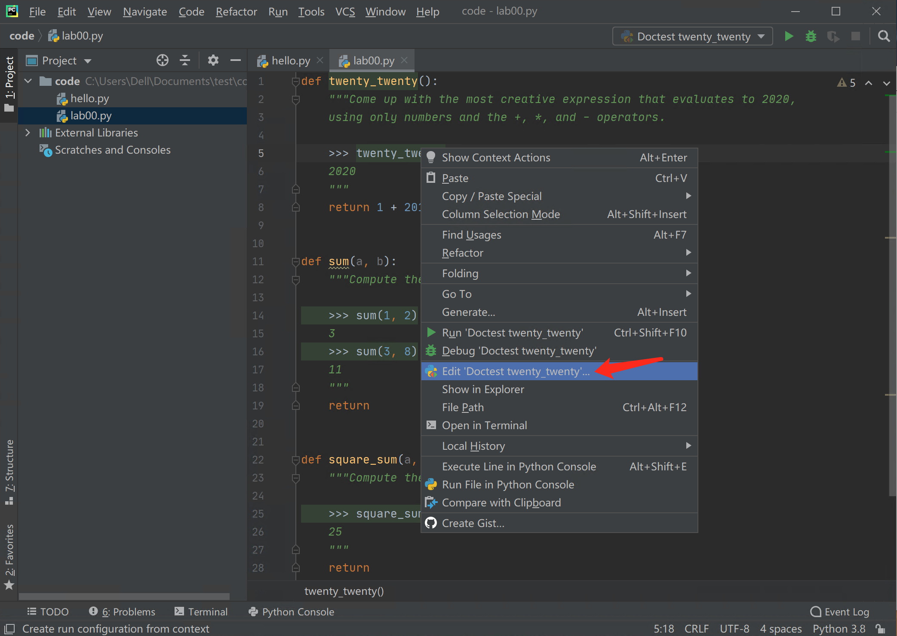

<p>
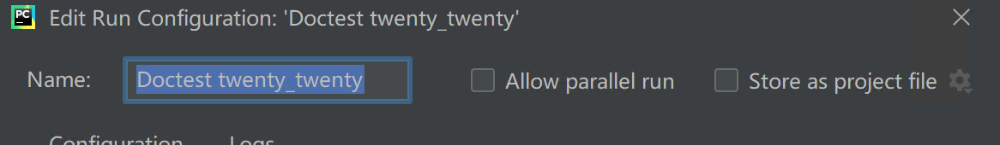

如果没有通过所有的doctest，则会显示红色惊叹号和错误信息；如果通过了所有的doctest，你会看到代表测试通过的勾形标记以及`Tests passed: xxx`的提示框，像下面一样。祝你在每一次实验都能看到这一场景！


对于喜欢终端操作的同学：首先，和之前一样，你需要使用`cd`命令把当前目录切换到`lab00.py`所在的目录下，接下来输入`python -m doctest lab00.py`。这个命令的内部原理基本上和你之前手动执行的过程一模一样。只不过，它会把`lab00.py`中其它你还没做的题目的doctest也一起执行了。所以实验刚开始你可能会看到很多其它的错误信息。比如，当你写完第一个题目后，你会看到下面的错误信息：

    $ python -m doctest lab00.py
    *****************************************************************
    File "C:\...\lab00\code\lab00.py", line 23, in lab00.square_sum
    Failed example:
        square_sum(3, 4)
    Expected:
        25
    Got nothing
    *****************************************************************
    File "C:\...\lab00\code\lab00.py", line 13, in lab00.sum
    Failed example:
        sum(1, 2)
    Expected:
        3
    Got nothing
    *****************************************************************
    File "C:\...\lab00\code\lab00.py", line 15, in lab00.sum
    Failed example:
        sum(3, 8)
    Expected:
        11
    Got nothing
    *****************************************************************
    2 items had failures:
    1 of   1 in lab00.square_sum
    2 of   2 in lab00.sum
    ***Test Failed*** 3 failures.

但仔细看下来，这都和大家接下来要做的两个题目（`sum`和`square_sum`）相关。所以暂时不用在意这样的错误信息。当你把所有题目做完后，如果使用`python -m doctest lab00.py`没有显示任何信息，那么就代表你通过了所有的doctest的测试。

### 4.4 提交作业与评分
现在我们不仅把代码写好了，还对它做了点测试相信它大概是对的。所以我们现在就来把它提交到助教准备的在线测试（OnlineJudge, 简称OJ）网站，取得应得的分数！

首先，打开OJ网站，网址为114.212.84.18。因为我们的网站架设在内网，所以如果在没有校园网的外网环境下，大家需要使用南大的vpn才能访问到OJ网站。

#### 4.4.1 注册账号
点击右上角 register 按钮，然后就能看到以下内容：

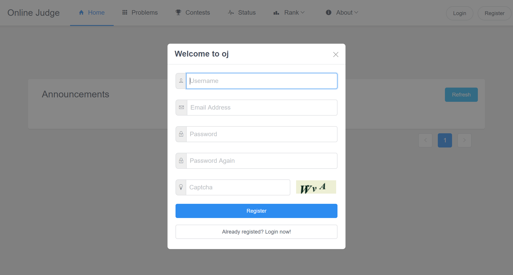


**Username请务必正确填写自己的学号**。我们会按照Username的学号来把这个账号获得的分给到你的成绩单上。Email Address和Password按自己心意填写即可。

注册完成之后网页会自动跳转到登录界面。大家可以输入自己的学号和刚刚填写的密码进行登录。

#### 4.4.2 提交代码
接下来点击页面顶部Contests菜单，进入Contests页面。我们以后的lab和homework都会以contest的形式来发布。下图中显示了一个叫做demo的contest。在大家进行实验的时候，会有一个叫做lab00的contest。请大家到时候进入lab00完成接下来演示的操作。

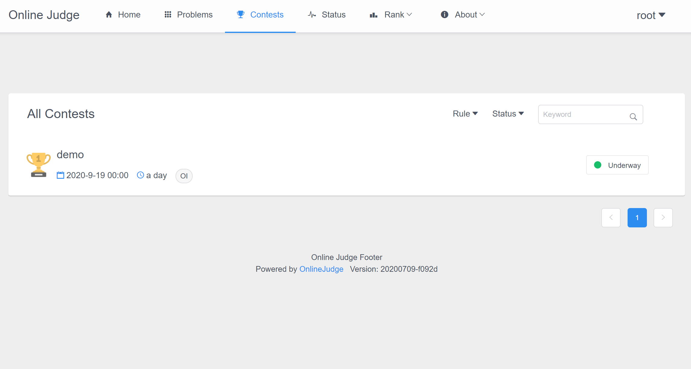

接下来，点击进入我们的demo contest（如下图所示）。首先可以看到此次作业的发布时间和截止时间。大家一定要留意ddl，否则过了时间，就无法提交作业了。

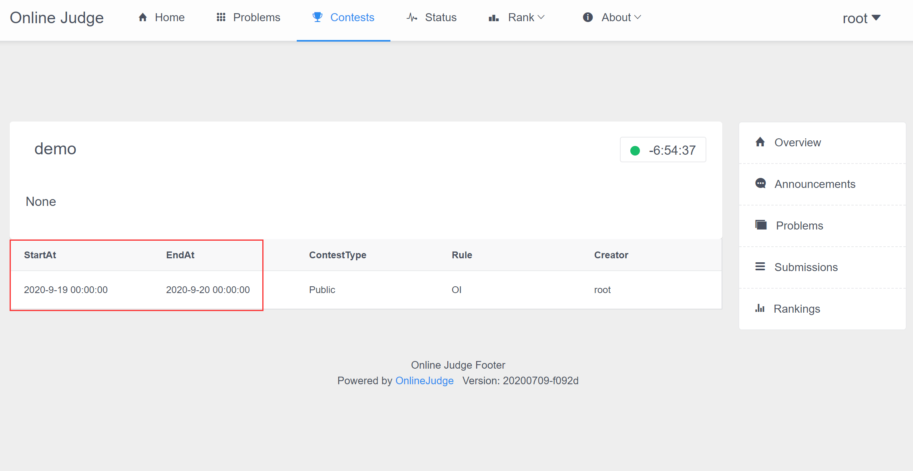

然后，大家点击右侧的Problems，查看本次contest有哪些题目。网页如下图所示。

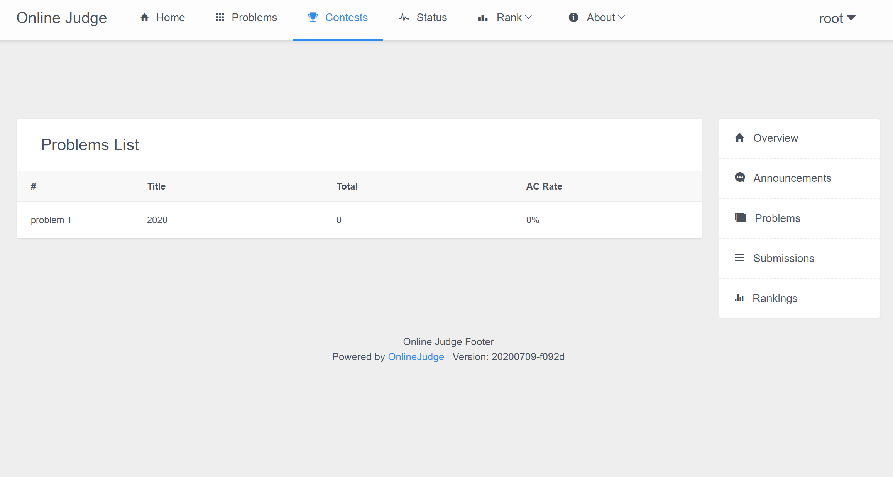

作为演示，我们这边只显示了之前我们带大家做的题目“2020”。接下来，点击进去，首先能看到题目描述 (如下图所示)。实验讲义和OJ网站上题目的描述都应该是一致的。

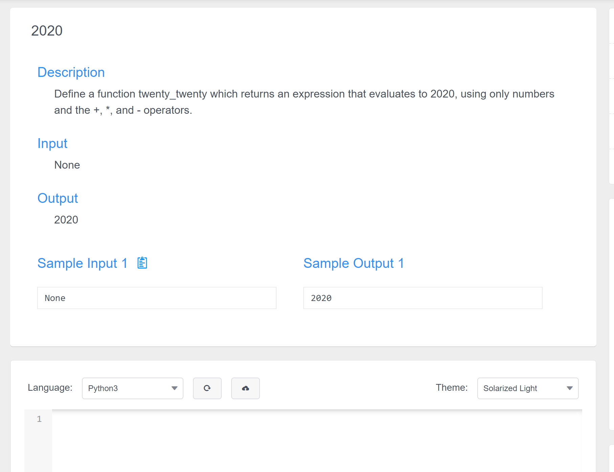

然后我们把`lab00.py`中关于twenty_twenty中的代码复制过去，即得到如下图的结果：

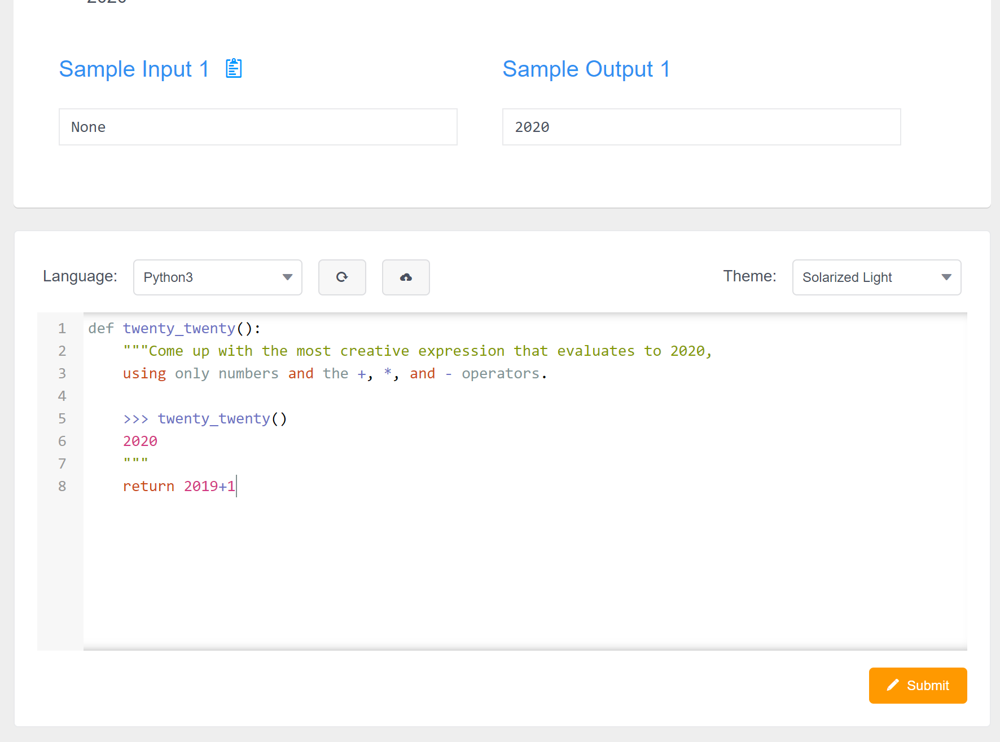

最后，点击右下角的submit按钮，你的代码就完成提交了。

#### 4.4.3 查看结果

我们使用的OJ网站能即时地给大家反馈测试结果，以方便同学们重新修改代码再次提交。下图显示了点击submit按钮后的结果——Accepted。大家也可以点击右侧的submissions查看自己历次的提交结果。

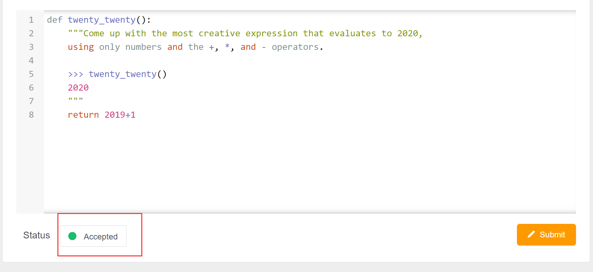


OJ网站在我们的实验设置下可能会显示以下的结果：

- Accepted(AC): 恭喜！你拿到了这道题的所有分数！
- Partial Accepted: 你的代码只通过了部分测试，但你依旧能获得相应的部分分数。大家的每一份努力都不应该被辜负。
- Wrong Answer(WA): 你的代码没有通过任何测试。很遗憾，你无法获得任何分数。
- Runtime Error(RE): 你的代码触发了运行时的错误。建议按照4.3节的指导在本地测试一下。
- Time Limit Exceeded(TLE): 你的代码运行时间超出了限制。比如出现了死循环。
- Memory Limit Exceeded(MLE): 你的代码使用了过多内存。
- System Error: OJ服务器出了问题。需要联系我们修复。

此外，大家可以通过点击contest右侧的Rankings来查看自己目前获得的总分，如下图所示。下图中的contest有两道题。第一题满分100分，第二题满分200分。我们会在实验讲义上给出每道题的总分。

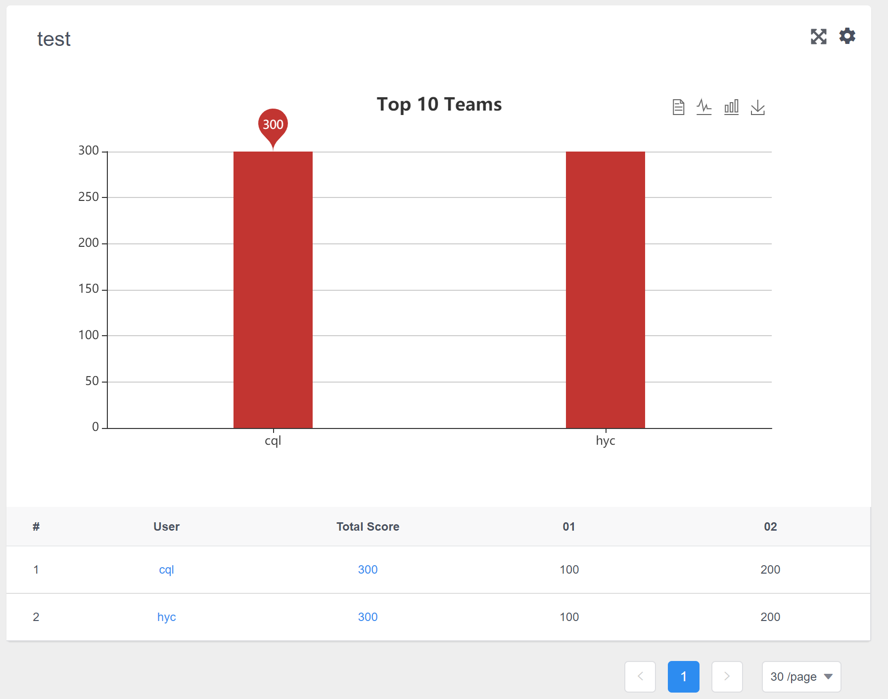


#### 4.4.4 其它要点

> 注意，OJ网站上，同一个题目的最新的提交结果会覆盖之前的提交结果。所以请大家务必确保每道题最后一次提交是你分数最高的代码。为了确保这一点，大家可以通过查看Rankings来确定自己的分数。助教们会从这里统计分数并录入成绩。

## 5. 本次实验内容
到此，大家应该顺利地做完并提交了第一道题目。希望这段旅程对大家足够顺利。接下来，我们还有两道简单的题目让大家再熟悉一下整个实验流程。如果你足够熟练的话，可能几分钟就做完了。此次实验的ddl设置为一周，大家不用着急。

### Problem 1: 2020 (100pts)
用数字和`+`,`*`和`-`运算符写一个最酷炫的表达式，来替换掉下面`twenty_twenty`函数中的下划线。

```python
def twenty_twenty():
    """Come up with the most creative expression that evaluates to 2020,
    using only numbers and the +, *, and - operators.

    >>> twenty_twenty()
    2020
    """
    return ______
```

### Problem 2: A + B (100pts)

写一个代表变量`a`和`b`之和的**算术表达式**，来替换掉下面`sum`函数中的下划线。

```python
def sum(a, b):
    """Compute the sum of a and b

    >>> sum(1, 2)
    3
    >>> sum(3, 8)
    11
    """
    return ______
```

### Problem 3: Square Sum (100pts)

写一个代表变量`a`和`b`的平方和的**算术表达式**，来替换掉下面`square_sum`函数中的下划线。

```python
def square_sum(a, b):
    """Compute the sum of square a and square b

    >>> square_sum(3, 4)
    25
    """
    return ______
```
