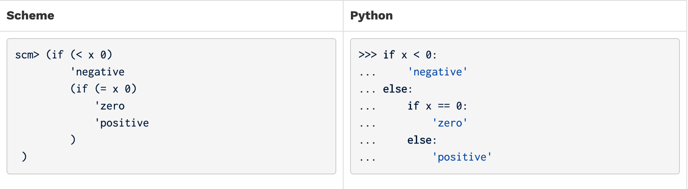
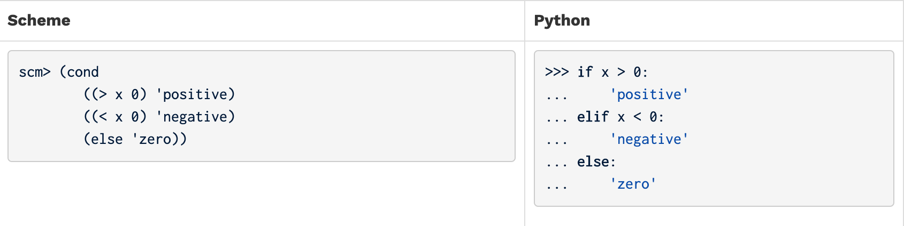

# Lab 07: Scheme

## 1. Instructions

> Please download lab materials `lab07.zip` from our QQ group if you don't have one.

In this lab, you have two task:
- Think about what scheme would display if the code described in section 3 were input to a scheme interpreter. You don't have to submit your answers in this task. See section 3 for more details.
- Complete the required problems described in section 4. The starter code for these problems is provided in `lab07.scm`, which is distributed as part of the lab materials in the `code` directory.

### Submissions

Because the OJ website that helps us a lot for these months cannot judge your scheme code, we have created a new online judging backend. Let's call it Grader. You will have to submit your answers to it in the following assignments. Don't worry, we will teach you how to do it soon. Besides, we still provide you `ok` instead of doctests to help test your code in the local environment, which you must have been familiar with during the `ants` project.

First of all, you can access our new Grader website by [114.212.84.18:5000](http://114.212.84.18:5000/). The ip address seems almost the same as our previous OJ website, except the additional "`:5000`". It represents the port listened by our Grader server.

> Learn more about what ip address and port is by searching the friendly website such as [Zhihu](https://www.zhihu.com/) ([IP](https://zhuanlan.zhihu.com/p/26030614) and [Port](https://zhuanlan.zhihu.com/p/34521011)).

If everything goes well, you will see some assignments and their corresponding deadlines in your browser. You can follow the link on any assignment name to see your corresponding scores, which may help you make sure that you have submitted your assignment successfully.

> **Don't forget to check the deadline!**

Wait! But how to submit my assignment? We have provide you a python script named `submit.py` to submit your assignment, which can be found in the root directory of our lab materials. Let me show you its usage.

If you want to submit your answers, first open your terminal and make sure your current working directory is somewhere the `lab07.scm` and `submit.py` is located by the `cd` command. It should be the `code/` directory if you haven't move or rename any files and directories since you unzipped `lab07.zip`. 

> If you don't know how to use `cd`, let us known. We will help you.

First, ensure that you have installed `pip` on your computer. You can enter the following command to check if you have installed it:

```
pip --version
```

>If you are using macOS, the command should be:
>
>```
>pip3 --version
>```

​If you see the version information like `pip xx.xx.xx from [some path]`, your  `pip` has already been installed. If your computer cannot find the path of `pip`, please contact the TAs.

Then, enter the following command to install the `requests` package which is needed by our submission script.

```
pip install requests
```

>If you are using macOS, the command should be:
>
>```
>pip3 install requests
>```

If you cannot see the success information returned by `pip` or information like `Requirement already satisfied: xxx`, the installation failed, and you can contact the TAs.

Now, enter the following command in the terminal to submit your answers to our Grader server and get them scored. 

```
python submit.py --stuid <YOUR STUDENT ID> --stuname <YOUR NAME>
```

For example, if your name is 张三 and your student ID is 201220000, the command you should enter is:

```
python submit.py --stuid 201220000 --stuname 张三
```

Please make sure that the student ID and name you entered are literally yours and are matched.

After waiting for a few seconds, you will see the following feedback text if your submission is successful. Recall that you can also check your final score by following the link in our [Grader website](http://114.212.84.18:5000/).

```
... (omitted)
Point breakdown
    over-or-under: xxx/100
    filter-lst: xxx/200
    make-adder: xxx/100
    no-repeats: xxx/200
    substitute: xxx/300
    sub_all: xxx/100

Score:
    Total: xxx

Cannot backup when running ok with --local.
```

**Tips:**

1. You should pass your local `ok` test before submitting your code to our Grader server.
2. You can submit your answers and get scored with only part of the assignment finished.
3. You may submit more than once before the deadline. The Grader will record your **highest** score.
4. If you cannot see feedback text for a long time after submission, please first use `python ok --local --score` to test locally, and check whether there is an infinite loop in your implementation.

If you have any technical problems with submission, please contact TAs.

> **WARNING:** Do not modify `submit.py`! 


## 2. Topics

Consult this section if you need a refresher on the material for this lab. It's okay to skip directly to the [questions](#3.-What-Would-Scheme-Display?) and refer back here should you get stuck.

### 2.1 Scheme

Scheme is a famous functional programming language from the 1970s. It is a dialect of Lisp (which stands for LISt Processing). The first observation most people make is the unique syntax, which uses a prefix notation and (often many) nested parentheses (see http://xkcd.com/297/). Scheme features first-class functions and optimized tail-recursion, which were relatively new features at the time.

>Our course uses a custom version of Scheme (which you will build for Project 4) included in the starter ZIP archive. To start the interpreter, type `python scheme`. To run a Scheme program interactively, type `python scheme -i <file.scm>`. To exit the Scheme interpreter, type `(exit)`.

You may find it useful to try [scheme.cs61a.org](https://scheme.cs61a.org/) when working through problems, as it can draw environment and box-and-pointer diagrams and it lets you walk your code step-by-step (similar to Python Tutor). Don't forget to submit your code through Ok though!

### 2.2 Expressions

#### 2.2.1 Atomic Expressions

Just like in Python, atomic, or primitive, expressions in Scheme take a single step to evaluate. These include numbers, booleans, symbols.

```scheme
scm> 1234    ; integer
1234
scm> 123.4   ; real number
123.4
```

#### 2.2.2 Symbols

Out of these, the symbol type is the only one we didn't encounter in Python. A **symbol** acts a lot like a Python name, but not exactly. Specifically, a symbol in Scheme is also a type of value. On the other hand, in Python, names only serve as expressions; a Python expression can never evaluate to a name.

```scheme
scm> quotient      ; A name bound to a built-in procedure
#[quotient]
scm> 'quotient     ; An expression that evaluates to a symbol
quotient
scm> 'hello-world!
hello-world!
```

#### 2.2.3 Booleans

In Scheme, *all* values except the special boolean value `#f` are interpreted as true values (unlike Python, where there are some false-y values like `0`). Our particular version of the Scheme interpreter allows you to write `True` and `False` in place of `#t` and `#f`. This is not standard.

```scheme
scm> #t
#t
scm> #f
#f
```

#### 2.2.4 Call expressions

Like Python, the operator in a Scheme call expression comes before all the operands. Unlike Python, the operator is included within the parentheses and the operands are separated by spaces rather than with commas. However, evaluation of a Scheme call expression follows the exact same rules as in Python:

1. Evaluate the operator. It should evaluate to a procedure.
2. Evaluate the operands, left to right.
3. Apply the procedure to the evaluated operands.

Here are some examples using built-in procedures:

```scheme
scm> (+ 1 2)
3
scm> (- 10 (/ 6 2))
7
scm> (modulo 35 4)
3
scm> (even? (quotient 45 2))
#t
```

#### 2.2.5 Special forms

The operator of a special form expression is a special form. What makes a special form "special" is that they do not follow the three rules of evaluation stated in the previous section. Instead, each special form follows its own special rules for execution, such as short-circuiting before evaluating all the operands.

Some examples of special forms that we'll study today are the `if`, `cond`, `define`, and `lambda` forms. Read their corresponding sections below to find out what their rules of evaluation are!

### 2.3 Control Structures

#### 2.3.1 `if` Expressions

The `if` special form allows us to evaluate one of two expressions based on a predicate. It takes in two required arguments and an optional third argument:

```scheme
(if <predicate> <if-true> [if-false])
```

The first operand is what's known as a **predicate** expression in Scheme, an expression whose value is interpreted as either `#t` or `#f`.

The rules for evaluating an `if` special form expression are as follows:

1. Evaluate `<predicate>`.
2. If `<predicate>` evaluates to a truth-y value, evaluate and return the value if the expression `<if-true>`. Otherwise, evaluate and return the value of `[if-false]` if it is provided.

Can you see why this expression is a special form? Compare the rules between a regular call expression and an `if` expression. What is the difference?

> Step 2 of evaluating call expressions requires evaluating all of the operands in order. However, an `if` expression will only evaluate two of its operands, the conditional expression and either `<true-result>` or `<false-result>`. Because we don't evaluate all the operands in an `if` expression, it is a special form.

Let's compare a Scheme `if` expression with a Python `if` statement:


Although the code may look the same, what happens when each block of code is evaluated is actually very different. Specifically, the Scheme expression, given that it is an expression, evaluates to some value. However, the Python `if` statement simply directs the flow of the program.

Another difference between the two is that it's possible to add more lines of code into the suites of the Python `if` statement, while a Scheme `if` expression expects just a single expression for each of the true result and the false result.

One final difference is that in Scheme, you cannot write `elif` cases. If you want to have multiple cases using the `if` expression, you would need multiple branched `if` expressions:



#### 2.3.2 `cond` Expressions

Using nested `if` expressions doesn't seem like a very practical way to take care of multiple cases. Instead, we can use the `cond` special form, a general conditional expression similar to a multi-clause if/elif/else conditional expression in Python. `cond` takes in an arbitrary number of arguments known as clauses. A clause is written as a list containing two expressions: `(<p> <e>)`.

```scheme
(cond
    (<p1> <e1>)
    (<p2> <e2>)
    ...
    (<pn> <en>)
    [(else <else-expression>)])
```

The first expression in each clause is a predicate. The second expression in the clause is the return expression corresponding to its predicate. The optional `else` clause has no predicate.

The rules of evaluation are as follows:

1. Evaluate the predicates `<p1>`, `<p2>`, ..., `<pn>` in order until you reach one that evaluates to a truth-y value.
2. If you reach a predicate that evaluates to a truth-y value, evaluate and return the corresponding expression in the clause.
3. If none of the predicates are truth-y and there is an `else` clause, evaluate and return `<else-expression>`.

As you can see, `cond` is a special form because it does not evaluate its operands in their entirety; the predicates are evaluated separately from their corresponding return expression. In addition, the expression short circuits upon reaching the first predicate that evaluates to a truth-y value, leaving the remaining predicates unevaluated.

The following code is roughly equivalent (see the explanation in the [if expression section](#2.3.1-`if`-Expressions)):



### 2.4 Lists

>As you read through this section, it may be difficult to understand the differences between the various representations of Scheme containers. We recommend that you use [CS61A's online Scheme interpreter](http://scheme.cs61a.org/) to see the box-and-pointer diagrams of pairs and lists that you're having a hard time visualizing! (Use the command `(autodraw)` to toggle the automatic drawing of diagrams.)

#### 2.4.1 Lists

Scheme lists are very similar to the linked lists we've been working with in Python. Just like how a linked list is constructed of a series of `Link` objects, a Scheme list is constructed with a series of pairs, which are created with the constructor `cons`.

Scheme lists require that the `cdr` is either another list or `nil`, an empty list. A list is displayed in the interpreter as a sequence of values (similar to the `__str__` representation of a `Link` object). For example,

```scheme
scm> (cons 1 (cons 2 (cons 3 nil)))
(1 2 3)
```

Here, we've ensured that the second argument of each `cons` expression is another `cons` expression or `nil`.


We can retrieve values from our list with the `car` and `cdr` procedures, which now work similarly to the Python `Link`'s `first` and `rest` attributes. (Curious about where these weird names come from? Check out their [etymology](https://en.wikipedia.org/wiki/CAR_and_CDR).)

```scheme
scm> (define a (cons 1 (cons 2 (cons 3 nil))))  ; Assign the list to the name a
a
scm> a
(1 2 3)
scm> (car a)
1
scm> (cdr a)
(2 3)
scm> (car (cdr (cdr a)))
3
```

If you do not pass in a pair or nil as the second argument to `cons`, it will error:

```scheme
scm> (cons 1 2)
Error
```

#### 2.4.2 `list` Procedure

There are a few other ways to create lists. The `list` procedure takes in an arbitrary number of arguments and constructs a list with the values of these arguments:

```scheme
scm> (list 1 2 3)
(1 2 3)
scm> (list 1 (list 2 3) 4)
(1 (2 3) 4)
scm> (list (cons 1 (cons 2 nil)) 3 4)
((1 2) 3 4)
```

Note that all of the operands in this expression are evaluated before being put into the resulting list.

#### 2.4.3 Quote Form

We can also use the quote form to create a list, which will construct the exact list that is given. Unlike with the `list` procedure, the argument to `'` is not evaluated.

```scheme
scm> '(1 2 3)
(1 2 3)
scm> '(cons 1 2)           ; Argument to quote is not evaluated
(cons 1 2)
scm> '(1 (2 3 4))
(1 (2 3 4))
```

#### 2.4.4 Built-In Procedures for Lists

There are a few other built-in procedures in Scheme that are used for lists. Try them out in the interpreter!

```scheme
scm> (null? nil)                ; Checks if a value is the empty list
True
scm> (append '(1 2 3) '(4 5 6)) ; Concatenates two lists
(1 2 3 4 5 6)
scm> (length '(1 2 3 4 5))      ; Returns the number of elements in a list
5
```

### 2.5 Defining procedures

The special form `define` is used to define variables and functions in Scheme. There are two versions of the `define` special form. To define variables, we use the `define` form with the following syntax:

```scheme
(define <name> <expression>)
```

The rules to evaluate this expression are

1. Evaluate the `<expression>`.
2. Bind its value to the `<name>` in the current frame.
3. Return `<name>`.

The second version of `define` is used to define procedures:

```scheme
(define (<name> <param1> <param2> ...) <body> )
```

To evaluate this expression:

1. Create a lambda procedure with the given parameters and `<body>`.
2. Bind the procedure to the `<name>` in the current frame.
3. Return `<name>`.

The following two expressions are equivalent:

```scheme
scm> (define foo (lambda (x y) (+ x y)))
foo
scm> (define (foo x y) (+ x y))
foo
```

`define` is a special form because its operands are not evaluated at all! For example, `<body>` is not evaluated when a procedure is defined, but rather when it is called. `<name>` and the parameter names are all names that should not be evaluated when executing this `define` expression.

### 2.6 Lambdas

All Scheme procedures are lambda procedures. To create a lambda procedure, we can use the `lambda` special form:

```scheme
(lambda (<param1> <param2> ...) <body>)
```

This expression will create and return a function with the given parameters and body, but it will not alter the current environment. This is very similar to a `lambda` expression in Python!

```scheme
scm> (lambda (x y) (+ x y))        ; Returns a lambda function, but doesn't assign it to a name
(lambda (x y) (+ x y))
scm> ((lambda (x y) (+ x y)) 3 4)  ; Create and call a lambda function in one line
7
```

A procedure may take in any number of parameters. The `<body>` may contain multiple expressions. There is not an equivalent version of a Python `return` statement in Scheme. The function will simply return the value of the last expression in the body.


## 3. What Would Scheme Display?

### WWSD: Lists

>Use Ok to test your knowledge with the following "What Would Scheme Display?" questions:
>```
>python ok --local -q wwsd_lists -u
>```

```scheme
scm> (cons 1 (cons 2 nil))
______

scm> (car (cons 1 (cons 2 nil)))
______

scm> (cdr (cons 1 (cons 2 nil)))
______

scm> (list 1 2 3)
______

scm> '(1 2 3)
______

scm> (cons 1 '(list 2 3))  ; Recall quoting
______
```

## 4. Required Problems

In this section, you are required to complete the problems below and submit your code according to [instructions](#1.-Instructions) in section 1.

### Problem 1: Over or Under (100 pts)

Define a procedure `over-or-under` which takes in a number `a` and a number `b` and returns the following:

- -1 if `a` is less than `b`
- 0 if `a` is equal to `b`
- 1 if `a` is greater than `b`

```scheme
(define (over-or-under a b)
  'YOUR-CODE-HERE
)

;;; Tests
(over-or-under 1 2)
; expect -1
(over-or-under 2 1)
; expect 1
(over-or-under 1 1)
; expect 0
```

Use Ok to unlock and test your code:

```
python ok --local -q over_or_under -u
python ok --local -q over_or_under
```

### Problem 2: Filter Lst (200 pts)

Write a procedure `filter-lst`, which takes a predicate `fn` and a list `lst`, and returns a new list containing only elements of the list that satisfy the predicate. The output should contain the elements in the same order that they appeared in the original list.

```scheme
(define (filter-lst fn lst)
  'YOUR-CODE-HERE
)

;;; Tests
(define (even? x)
  (= (modulo x 2) 0))
(filter-lst even? '(0 1 1 2 3 5 8))
; expect (0 2 8)
```

Use Ok to unlock and test your code:

```
python ok --local -q filter_lst -u
python ok --local -q filter_lst
```

### Problem 3: Make Adder (100 pts)

Write the procedure `make-adder` which takes in an initial number, `n`, and then returns a procedure. This returned procedure takes in a number `x` and returns the result of `x + n`.

*Hint*: To return a procedure, you can either return a `lambda` expression or `define` another nested procedure. Remember that Scheme will automatically return the last clause in your procedure.

```scheme
(define (make-adder n)
  'YOUR-CODE-HERE
)

;;; Tests
(define adder (make-adder 5))
(adder 8)
; expect 13
```

Use Ok to unlock and test your code:

```
python ok --local -q make_adder -u
python ok --local -q make_adder
```

### Problem 4: No Repeats (200 pts)

Implement `no-repeats`, which takes a list of numbers `s` as input and returns a list that has all of the unique elements of `s` in the order that they first appear, but no repeats. For example, `(no-repeats (list 5 4 5 4 2 2))` evaluates to `(5 4 2)`.

*Hints*: To test if two numbers are equal, use the `=` procedure. To test if two numbers are not equal, use the `not` procedure in combination with `=`. You may find it helpful to use the `filter-lst` procedure.

```scheme
(define (no-repeats s)
  'YOUR-CODE-HERE
)
```

Use Ok to unlock and test your code:

```
python ok --local -q no_repeats -u
python ok --local -q no_repeats
```

### Problem 5: Substitute (300 pts)

Write a procedure `substitute` that takes three arguments: a list `s`, an `old` word, and a `new` word. It returns a list with the elements of `s`, but with every occurrence of `old` replaced by `new`, even within sub-lists.

*Hint*: The built-in `pair?` predicate returns True if its argument is a `cons` pair.

*Hint*: The `=` operator will only let you compare numbers, but using `equal?` or `eq?` will let you compare symbols as well as numbers. For more information, check out the [Scheme Built-in Procedure Reference](https://inst.eecs.berkeley.edu/~cs61a/sp20/articles/scheme-builtins.html#boolean-operations).

Use Ok to unlock and test your code:

```
python ok --local -q substitute -u
python ok --local -q substitute
```

```scheme
(define (substitute s old new)
  'YOUR-CODE-HERE
)
```

### Problem 6: Sub All (100 pts)

Write `sub-all`, which takes a list `s`, a list of `old` words, and a list of `new` words; the last two lists must be the same length. It returns a list with the elements of s, but with each word that occurs in the second argument replaced by the corresponding word of the third argument. You may use `substitute` in your solution. Assume that `olds` and `news` have no elements in common.

```scheme
(define (sub-all s olds news)
  'YOUR-CODE-HERE
)
```

Use Ok to unlock and test your code:

```
python ok --local -q sub_all -u
python ok --local -q sub_all
```

After all, remember to submit your answers by

```
python submit.py --stuid [YOUR STUDENT ID] --stuname [YOUR NAME]
```